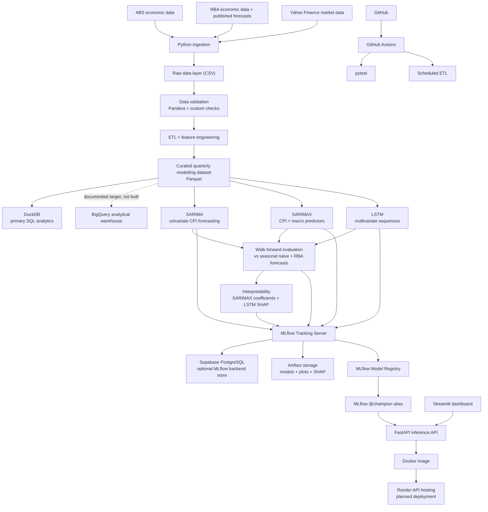

# CPI Forecasting Platform - Project Architecture

## 1. Portfolio Objective

This project extends a university Australian Consumer Price Index (CPI)
forecasting assignment into an end-to-end data science portfolio project.

The original assignment built a univariate SARIMA model using historical CPI
observations. The portfolio version keeps that statistical forecasting problem
at the centre, then expands the project into a reproducible forecasting
platform with data ingestion, ETL, validation, SQL analytics, multivariate
modelling, experiment tracking, API serving, dashboarding, testing, and CI/CD.

The goal is to demonstrate practical junior Data Scientist, Data Engineer, and
ML Engineer skills through one coherent project, without adding infrastructure
the dataset doesn't justify. Every platform in the architecture has a defined
role, and every role is traceable back to a decision explained in
[Section 5, Architecture Decisions](#5-architecture-decisions-and-trade-offs).

**Design rule:** rather than partially wiring up every tool a data role might
touch, this project builds one flagship artifact per skill pillar and
documents the rest as a deliberate target architecture. A shallow
implementation of ten platforms is a weaker signal than a deep, working
implementation of three, backed by a written explanation of why the others
were scoped out for now.

| Pillar | Flagship portfolio deliverable | Supporting evidence (present, but not the headline) |
|---|---|---|
| Data Science | SARIMA vs SARIMAX vs LSTM comparison, walk-forward validated, benchmarked against both seasonal naive and the RBA's own published inflation forecast, with interpretability | EDA notebook, feature engineering |
| Data Engineering | Ingestion -> validation -> curated Parquet -> DuckDB, fully local and credential-free | BigQuery documented as target warehouse architecture, not deployed |
| ML Engineering | MLflow experiment tracking, model registry, FastAPI selected-model serving, Docker, and planned Render deployment | Postgres/Supabase as the optional MLflow backend/run metadata store (not a duplicate warehouse) |

## 2. Recruiter-Facing Summary

This project is an Australian inflation forecasting platform built with
Python, ABS/RBA/market data ingestion, leakage-aware ETL, validation, curated
modelling datasets, SQL analytics, SARIMA/SARIMAX/LSTM model comparison,
walk-forward validation against both a seasonal naive benchmark and the RBA's
own published inflation forecasts, model interpretability, MLflow experiment
tracking, FastAPI model serving, Docker, Streamlit, automated tests, and
GitHub Actions.

Current implemented/scaffolded evidence includes reproducible data ingestion,
ETL, custom validation, Pandera validation, Parquet output, DuckDB analytical
loading, curated macro features, SQL query scaffolds, a baseline FastAPI
service, an initial Streamlit dashboard, Docker configuration, pytest tests,
and GitHub Actions workflows. A cloud data warehouse (BigQuery) is documented
as a target architecture rather than built, because the current dataset size
does not justify it -- see Section 5 for the reasoning. Supabase PostgreSQL
still requires account-level configuration before it should be described as
deployed.

The project demonstrates:

- end-to-end data science workflow design
- reproducible multi-source economic data ingestion
- time-series forecasting and model evaluation, benchmarked against a
  professional forecaster (the RBA), not just a naive baseline
- feature engineering with macroeconomic indicators
- data validation and quality reporting
- SQL analytics and warehouse-scale design judgment (knowing when *not* to
  provision a warehouse, as well as how to build one)
- backend API design for model serving
- interactive dashboard development
- containerised deployment
- CI/CD and scheduled pipeline automation
- the engineering judgment to scope infrastructure to the size of the problem

## 3. Core Forecasting Question

The project asks:

> Can Australian CPI forecasts be improved by combining historical CPI values
> with external macroeconomic indicators such as unemployment, wages, producer
> prices, interest rates, exchange rates, inflation expectations, commodity
> prices, and oil prices -- and how do those forecasts compare to the RBA's own
> published inflation projections?

The model comparison uses **two benchmarks** and three primary forecasting
models:

- **Seasonal naive** -- a simple statistical reference forecast
- **RBA published inflation forecast** -- the professional forecaster's own
  projection for the same period, used as a real-world credibility check
  rather than only a statistical strawman

1. **SARIMA** - univariate statistical forecasting using CPI history
2. **SARIMAX** - multivariate statistical forecasting using CPI and selected
   external macroeconomic indicators
3. **LSTM** - multivariate deep-learning forecasting using historical sequences
   of CPI and selected macroeconomic indicators

The comparison is designed to test whether additional information and model
complexity improve forecasting performance, and whether that improvement is
large enough to be practically useful compared to a real institutional
forecast:

```text
Seasonal Naive benchmark           RBA published forecast benchmark
        v                                       v
SARIMA                                          |
univariate statistical model                    |
        v                                       |
SARIMAX                                         |
multivariate statistical model                  |
        v                                       |
LSTM                                            |
multivariate nonlinear sequence model  <---------
```

Models will be evaluated using the same chronological walk-forward validation
framework so the comparison reflects how each model would behave in practice.
The LSTM is treated as a deep-learning challenger rather than an assumed
winner, because the quarterly dataset contains relatively few observations for
training a neural network. Beating a seasonal naive model is a low bar;
approaching or beating the RBA's own forecast accuracy is the bar that
actually matters, and the project should say so honestly if it isn't cleared.

## 4. Current Status vs Target Architecture

This distinction is important for portfolio credibility.

| Area | Current repository status | Target portfolio version |
|---|---|---|
| Baseline forecasting | Implemented in `cpi_forecast_V1.ipynb` | Refactored into reusable modelling modules |
| Data ingestion | Implemented in `data_retrieval.py` | Modular ingestion package with logging and tests |
| Data sources | ABS, RBA, yfinance data downloaded to `dataset/` | Same sources with scheduled refresh, plus RBA published forecast series |
| Data manifest | Implemented as `dataset/download_manifest.json` | Used in data-quality and pipeline-run reporting |
| ETL | Implemented in `src/build_curated_dataset.py` | Stable; no further cloud loads planned by default |
| Validation | Implemented with custom checks and optional Pandera in `src/platform_validation.py` | Expand Pandera schemas later |
| SQL analytics (flagship) | DuckDB load hook and SQL queries scaffolded | DuckDB fully implemented as the primary, credential-free analytics layer |
| Cloud warehouse | Not built | **Documented target only** (Section 5) -- BigQuery load hook may be added as a stretch goal, not a requirement |
| Application database | Schema and optional PostgreSQL quality-report load scaffolded | Supabase PostgreSQL scoped specifically to MLflow-adjacent run/metrics/forecast-output metadata (Section 5) |
| Multivariate/deep-learning modelling (flagship) | Planned | SARIMAX and a compact TensorFlow/Keras LSTM challenger, with interpretability |
| Benchmark forecasts | Seasonal naive only | Seasonal naive + RBA published inflation forecast |
| Experiment tracking (flagship) | Dependency/config scaffolded | Real MLflow runs logged for every model, not just configured |
| API (flagship) | Implemented baseline FastAPI service in `api/main.py` | Serves the selected champion model; Render deployment planned |
| Dashboard | Implemented initial Streamlit app in `app/streamlit_app.py` | Add EDA and model-comparison pages, calling the FastAPI forecast endpoint |
| Deployment (flagship) | Dockerfile scaffolded | Render API deployment, live and linked from the README after verification |
| Automation | Implemented pytest files and GitHub Actions workflows | Confirm workflows after GitHub push |

## 5. Architecture Decisions and Trade-offs

This section exists so a reviewer never has to guess why a tool is present,
absent, or only partially built. Each entry states the decision and the
reasoning, the way it would come up in an interview.

### 5.1 Why DuckDB is the SQL flagship instead of BigQuery

The curated dataset is a single quarterly table with roughly 120-125 rows.
DuckDB reads the Parquet file directly, requires no account, no credentials,
and no network access, and is fast enough that query latency is never a
concern at this scale. BigQuery would add real value once the project needed
to store many pipeline runs, higher-frequency data, or multiple analysts
querying concurrently -- none of which apply here yet. BigQuery is documented
as the target warehouse and the ETL retains an optional `--load-bigquery`
hook, but it is intentionally not treated as "built" in status reporting. The
decision itself -- recognising when a managed warehouse is not yet justified
-- is the data-engineering judgment being demonstrated, not the absence of
GCP exposure.

### 5.2 Why Postgres/Supabase holds MLflow backend and run metadata, not a second copy of the data

Rather than duplicating the analytical dataset in a second database (which
would just be "BigQuery lite" with no new skill demonstrated), Postgres is
scoped narrowly to what a relational store is actually good at: tracking
MLflow experiment metadata and application-level `pipeline_runs`,
`model_metrics`, and `forecast_results` over time. Supabase PostgreSQL can be
used as the planned MLflow backend store once configured, while model files,
plots, and SHAP outputs remain in MLflow artifact storage. This gives
Postgres a distinct job from DuckDB instead of overlapping with it, which is
the detail an interviewer is actually checking for when they ask "why two
databases."

### 5.3 Why MLflow + FastAPI + Docker + Render is the ML Engineering flagship

Of the MLOps/deployment-adjacent tools available, this combination is the one
that produces something a reviewer can actually click on: a live forecast
endpoint, backed by tracked, comparable experiment runs. Kubernetes,
Terraform, and a real-time serving layer are excluded (Section 30) because
they solve problems this project doesn't have -- a single small model, served
to a handful of requests, with no elastic scaling requirement.

### 5.4 Why the RBA published forecast is included as a second benchmark

A seasonal naive model is a useful statistical floor, but it is not a
meaningful bar for a portfolio piece about inflation forecasting -- almost any
reasonable model can beat it. The RBA publishes its own inflation forecasts
alongside actual outcomes, so comparing SARIMA/SARIMAX/LSTM against those
published projections tests whether the models are competitive with a real
professional forecaster, not just better than a strawman. This is a stronger
and more interview-defensible claim than "beat the seasonal naive."

### 5.5 Why interpretability is treated as a first-class deliverable, not an afterthought

Forecast accuracy alone answers "did it work." Interpretability -- SARIMAX
coefficient signs and magnitudes checked against economic theory, and
permutation importance or SHAP values for the LSTM -- answers "did it work
for a reason that makes sense," which is the question a hiring manager
actually wants answered when the model disagrees with the benchmark.

## 6. High-Level Architecture

The high-level flow is MLflow-centred: model training and walk-forward
evaluation produce tracked runs, artifacts, and registry candidates; only the
selected champion model is promoted to the serving path. This keeps the API
focused on inference rather than training logic.



## 7. Architecture Principles

The project follows several design principles that are worth highlighting in a
job-search portfolio:

- Keep the statistical forecasting problem central.
- Use external indicators only when they can be justified economically.
- Avoid look-ahead bias in feature engineering and validation.
- Separate raw data, processed data, and curated modelling datasets.
- Track experiments so model comparisons are reproducible.
- Use SQL where it adds analytical value, and say so explicitly when it
  wouldn't yet (Section 5.1).
- Prefer simple cloud services over over-engineered infrastructure, and give
  each service a distinct job rather than letting two tools do the same thing.
- Add tests around pipeline logic, transformations, and model outputs.
- Make the dashboard useful for exploration, not just decorative.
- Benchmark against a real forecaster, not only a naive statistical floor.
- Clearly document what is implemented versus planned, and *why*.

## 8. Technology Stack

| Layer | Tools | Skill demonstrated |
|---|---|---|
| Language | Python | data science programming, modular design |
| Data retrieval | `readabs`, `yfinance`, `pandas` | API/library-based data ingestion |
| Data storage | CSV, Parquet | reproducible local data layers |
| Validation | custom checks, Pandera | defensive data engineering |
| Local analytics (flagship) | DuckDB | SQL over local analytical files |
| Cloud warehouse | BigQuery -- documented target, optional load hook | warehouse design judgment, GCP familiarity |
| Relational store | Supabase PostgreSQL -- run/metrics metadata | scoped relational modelling, not a duplicate warehouse |
| Statistical forecasting | statsmodels, pmdarima | SARIMA/SARIMAX, time-series modelling |
| Deep learning | TensorFlow, Keras | LSTM sequence modelling, regularisation, neural forecasting |
| Interpretability | SHAP, statsmodels coefficient summaries | model explainability, economic validation of model behaviour |
| Experiment tracking (flagship) | MLflow | MLOps and reproducibility |
| API (flagship) | FastAPI, Pydantic | backend development and model serving |
| Dashboard | Streamlit | interactive data product development |
| Testing | pytest | regression testing and reliability |
| Automation | GitHub Actions | CI/CD and scheduled jobs |
| Deployment (flagship) | Docker, Render | containerisation and cloud deployment |
| Version control | Git, GitHub | professional software workflow |

## 9. Data Sources

### 9.1 Australian Bureau of Statistics

ABS data is retrieved through `readabs`.

Candidate variables:

- CPI index
- unemployment rate
- Wage Price Index
- Producer Price Index
- household spending

Portfolio value:

- official public data
- macroeconomic feature engineering
- handling mixed frequencies and publication structures
- reproducible ingestion from source systems

### 9.2 Reserve Bank of Australia

RBA data is retrieved through `readabs`.

Candidate variables:

- official cash rate
- AUD/USD exchange rate
- inflation expectations
- commodity price indexes
- **published RBA inflation forecasts** (Statement on Monetary Policy /
  forecast tables), used as the second benchmark in Section 3

Portfolio value:

- monetary-policy indicators
- exchange-rate effects
- expected inflation signals
- external cost-pressure indicators
- a real, professional forecast to benchmark against

### 9.3 Yahoo Finance

Market data is retrieved through `yfinance`.

Candidate variables:

- WTI crude oil futures
- Brent crude oil futures

Portfolio value:

- market data ingestion
- daily-to-quarterly aggregation
- external commodity shock features

## 10. Existing Data Retrieval Pipeline

The current `data_retrieval.py` script is already a strong portfolio component.
It demonstrates more than a simple notebook download cell.

Implemented capabilities:

- command-line interface with inclusive start and end years
- configurable output directory
- ABS series retrieval by catalogue and series ID
- RBA table retrieval with series and metadata-based selection
- yfinance retrieval for WTI and Brent crude oil
- date filtering across PeriodIndex, DatetimeIndex, and date-column inputs
- flattened columns for clean CSV output
- metadata export for ABS/RBA sources
- row counts, column names, package versions, and timestamps in a manifest
- explicit input validation for year ranges
- error handling for failed source retrievals

Planned addition:

- RBA published inflation forecast retrieval, saved alongside the existing
  RBA indicators so the benchmark in Section 3 can be built from the same
  reproducible pipeline rather than a manual download

Current output structure:

```text
dataset/
+-- abs/
|   +-- cpi_index_1995_2025.csv
|   +-- unemployment_rate_1995_2025.csv
|   +-- wage_price_index_1995_2025.csv
|   +-- producer_price_index_1995_2025.csv
|   +-- household_spending_1995_2025.csv
+-- rba/
|   +-- cash_rate_1995_2025.csv
|   +-- aud_usd_exchange_rate_1995_2025.csv
|   +-- inflation_expectations_1995_2025.csv
|   +-- commodity_prices_1995_2025.csv
|   +-- rba_published_inflation_forecast_1995_2025.csv   (planned)
+-- market/
|   +-- wti_crude_oil_1995_2025.csv
|   +-- brent_crude_oil_1995_2025.csv
+-- download_manifest.json
```

Example command:

```bash
python data_retrieval.py 1995 2025 --output-dir dataset
```

## 11. Implemented Data Pipeline

The current portfolio pipeline uses `dataset/` as the raw source layer produced
by `data_retrieval.py`, then creates processed and curated outputs under
`data/`.

```text
dataset/
+-- abs/
+-- rba/
+-- market/
+-- download_manifest.json

data/
+-- processed/
+-- curated/
+-- analytics/

reports/
+-- data_quality_report.csv
+-- platform_implementation_status.csv
```

### Raw Source Layer

Purpose:

- preserve downloaded source data
- make the pipeline auditable
- avoid manual edits to observations

Examples:

```text
dataset/abs/
dataset/rba/
dataset/market/
```

### Processed Layer

Purpose:

- standardise individual datasets
- clean dates and column names
- store source-specific transformed outputs

Common schema:

```text
date
variable
value
quarter
value
```

### Curated Layer

Purpose:

- create the final quarterly modelling table
- align all candidate predictors to CPI frequency
- apply leakage-aware transformations and lags

Example file:

```text
data/curated/quarterly_macro_features.csv
data/curated/quarterly_macro_features.parquet
```

### Analytics Layer

Purpose:

- load curated features and validation results into DuckDB
- provide a local, credential-free SQL workflow (the flagship SQL layer, see
  Section 5.1, not a placeholder before a cloud warehouse)

Implemented file:

```text
data/analytics/cpi_forecast.duckdb
```

## 12. ETL Design

### Extract

Download data from:

- ABS
- RBA (including published inflation forecasts)
- Yahoo Finance

The extraction step should save source data and a manifest before any modelling
transformation is applied.

### Transform

Core transformations:

- parse and validate dates
- standardise column names
- remove duplicate observations
- convert monthly data to quarterly data
- aggregate daily market data to quarterly frequency
- calculate quarterly and year-ended inflation
- calculate growth rates for index variables
- create lagged economic indicators
- merge predictors into one modelling table
- align RBA published forecasts to the quarters they were forecasting, so the
  benchmark comparison is apples-to-apples with model forecast horizons
- avoid back-filling future information into past forecast origins

Example transformations:

```text
CPI index
-> quarterly CPI growth
-> year-ended CPI inflation

Wage Price Index
-> wage growth
-> lagged wage growth

WTI oil price
-> quarterly average
-> quarterly percentage change
-> lagged oil-price change

Cash rate
-> quarterly value
-> lag 1
-> lag 2
-> lag 4
```

### Load

The current ETL load stage writes to:

1. CSV for easy notebook use
2. Parquet for local modelling and analytics
3. DuckDB for local SQL exploration (flagship, always run)
4. a data-quality report CSV

Optional platform loads are implemented behind explicit flags and are treated
as stretch goals, not requirements for the MVP:

```bash
python -m src.build_curated_dataset --load-bigquery
python -m src.build_curated_dataset --load-postgres
```

`--load-postgres` writes run/metrics metadata rather than a duplicate of the
curated dataset (Section 5.2). Both flags require cloud credentials and
environment variables before use.

## 13. Target Modelling Dataset

Candidate columns:

```text
quarter
cpi_index
cpi_qoq
cpi_yoy
unemployment_rate
wpi_growth
ppi_growth
household_spending_growth
cash_rate
aud_usd
aud_usd_change
inflation_expectations
commodity_growth
wti_growth
brent_growth
rba_forecast_cpi_yoy          (benchmark column, not a model input)
cash_rate_lag1
cash_rate_lag2
cash_rate_lag4
wpi_growth_lag1
wpi_growth_lag2
ppi_growth_lag1
oil_growth_lag1
```

Important rule:

Features must only use information that would have been known at the forecast
origin. This prevents look-ahead bias and makes the forecast evaluation more
credible. The `rba_forecast_cpi_yoy` column is kept separate from the model
feature set -- it is a benchmark to evaluate against, not a predictor to train
on.

## 14. Data Validation

Validation is implemented in two layers.

### Custom Validation

`src/validation.py` validates raw, processed, and curated datasets with
transparent checks.

Implemented checks:

```text
required columns exist
date values are parseable
dates are unique
dates are sorted
numeric columns are numeric
unexpected empty datasets are rejected
CPI target values are not missing
duplicate quarters are rejected
quarterly modelling table has one row per quarter
lagged features do not alter row ordering
```

### Pandera Validation

`src/platform_validation.py` validates the curated modelling dataset using
Pandera. This makes the target validation platform part of the ETL run instead
of only a future plan.

### Quality Report

The ETL writes:

```text
reports/data_quality_report.csv
```

Current platform validation records include:

```text
pandera:curated_quarterly_macro_features   PASS
platform:duckdb                            PASS
```

Example report rows:

| Dataset | Status | Notes |
|---|---|---|
| CPI | PASS | Complete quarterly target |
| Unemployment | PASS | Monthly series converted to quarterly |
| WPI | PASS | Quarterly index converted to growth |
| PPI | PASS | Quarterly index converted to growth |
| Cash rate | PASS | Monthly values converted to quarterly |
| Inflation expectations | PASS | Business expectations series has full quarterly coverage |
| WTI | PASS | Daily prices aggregated to quarterly |
| Brent | PASS | Daily prices aggregated to quarterly |
| Household spending | WARNING | Shorter history than core predictors |
| RBA published forecast | PASS (planned) | Aligned to forecast target quarter, kept out of model features |
| Pandera curated schema | PASS | Required curated columns passed schema validation |
| DuckDB load | PASS | Curated data and validation report loaded locally |

Skills demonstrated:

- data quality engineering
- schema validation
- defensive programming
- trustworthy modelling inputs

## 15. Exploratory Data Analysis

The EDA should be statistically focused and leakage-aware.

Core EDA:

- data coverage by variable
- missingness by variable and time period
- CPI index plot
- quarterly inflation plot
- year-ended inflation plot
- external-indicator plots
- seasonal decomposition
- ACF and PACF analysis
- Augmented Dickey-Fuller stationarity tests
- optional KPSS stationarity tests
- lagged correlation analysis
- Granger causality screening
- predictor correlation matrix
- multicollinearity checks such as VIF
- structural-period review around COVID and the post-COVID inflation surge
- comparison of historical RBA forecast errors, to set a realistic accuracy
  expectation before modelling begins

EDA deliverables:

- variable coverage table
- transformation decisions
- candidate lag decisions
- shortlist of SARIMAX predictors
- notes on feature availability at forecast time
- a short note on how accurate the RBA's own forecasts have historically been,
  used later to judge whether model results are competitive

## 16. Feature Engineering

Candidate feature groups:

| Feature group | Variables | Economic rationale |
|---|---|---|
| CPI history | `cpi_lag1`, `cpi_lag4` | trend and quarterly seasonality |
| Labour market | unemployment, wage growth | demand and wage-pressure channels |
| Price pressure | PPI, commodity prices | upstream cost pressure |
| Monetary policy | cash rate and lags | delayed policy effect on inflation |
| Exchange rate | AUD/USD changes | imported inflation |
| Energy markets | WTI, Brent | fuel, transport, and production costs |
| Expectations | inflation expectations | forward-looking inflation behaviour |

Candidate lag features:

```text
cpi_lag1
cpi_lag4
cash_rate_lag1
cash_rate_lag2
cash_rate_lag4
wpi_growth_lag1
wpi_growth_lag2
ppi_growth_lag1
ppi_growth_lag2
aud_usd_change_lag1
commodity_growth_lag1
wti_growth_lag1
brent_growth_lag1
```

## 17. Forecasting Models

The project uses two benchmarks and three primary models. Each model has a
different role in the research question rather than being included only to
increase the number of algorithms.

### Benchmark 1: Seasonal Naive

Purpose:

- provide a simple seasonal reference forecast
- test whether the primary models add genuine predictive value
- retain a difficult-to-beat benchmark for quarterly economic data

### Benchmark 2: RBA Published Inflation Forecast

Purpose:

- provide a real-world, professional-forecaster reference point
- test whether the project's models are competitive with an institution that
  has more information (policy intentions, liaison data, judgment) than any
  of the statistical models use
- keep the project honest: if a SARIMAX model can't beat seasonal naive by
  much, it almost certainly won't be competitive with the RBA either, and the
  writeup should say so

Neither benchmark is counted as one of the three primary models.

### Primary Model 1: SARIMA

The original notebook selected:

```text
SARIMA(0, 1, 1)(0, 1, 1)[4]
```

Inputs:

```text
historical CPI only
```

Purpose:

- capture CPI autoregressive behaviour
- capture trend through differencing
- capture quarterly seasonality
- provide the interpretable univariate statistical baseline

Research question:

> How well can CPI be forecast using only its own historical structure?

### Primary Model 2: SARIMAX

SARIMAX extends SARIMA by adding external variables.

Candidate variants:

```text
SARIMAX + labour variables
SARIMAX + price-pressure variables
SARIMAX + monetary variables
SARIMAX + commodity and oil variables
SARIMAX + selected combined predictors
```

Purpose:

- test whether external economic indicators improve CPI forecasts
- connect predictive performance to economic reasoning
- compare variable groups through ablation studies

Research question:

> Does adding economically justified macroeconomic information improve on the
> univariate SARIMA forecast?

**Interpretability:** report the fitted coefficient sign and magnitude for
each exogenous variable and check it against economic expectations (e.g. cash
rate lags should carry a plausible sign and timing). A coefficient that
contradicts basic macro theory is worth flagging and investigating, not
hiding.

### Primary Model 3: LSTM

A compact Long Short-Term Memory (LSTM) network will be implemented with
TensorFlow/Keras as the deep-learning challenger.

Unlike SARIMAX, the LSTM can learn nonlinear relationships from multivariate
historical sequences.

Example input structure:

```text
Previous 8 quarters
        |
        +-- CPI
        +-- unemployment
        +-- WPI growth
        +-- PPI growth
        +-- cash rate
        +-- commodity growth
        +-- oil-price growth
        +-- inflation expectations
        |
        v
       LSTM
        |
        v
Future CPI forecast
```

The LSTM should use the same core predictor set as SARIMAX where possible so the
comparison focuses on modelling approach rather than giving one model more
information.

A deliberately small architecture should be used, for example:

```text
Input sequence
-> LSTM with approximately 8-16 hidden units
-> Dropout / regularisation
-> Dense forecast output
```

Purpose:

- test whether nonlinear temporal relationships add forecasting value
- demonstrate sequence modelling and deep-learning workflow
- compare a neural forecasting method with traditional statistical models

Research question:

> Can a nonlinear sequence model learn useful CPI relationships that are not
> captured by SARIMAX?

**Interpretability:** use permutation importance or SHAP on the trained LSTM
to check which input features drive its predictions, and compare that ranking
to the SARIMAX coefficients. Agreement between the two is a stronger claim
than either model's accuracy number alone.

### LSTM Sample-Size Limitation

The quarterly dataset from approximately 1995 onward contains only around
120-125 observations before sequence construction and train/test splitting.
This is small for deep learning.

Therefore:

- the LSTM should remain compact
- aggressive hyperparameter tuning should be avoided
- early stopping and regularisation should be used
- feature scaling must be fitted on the training portion only
- chronological validation must be preserved
- overfitting should be explicitly assessed

The LSTM is not expected to outperform SARIMA or SARIMAX automatically. If it
performs worse, that is still an informative result showing that additional
model complexity is not necessarily beneficial for a small quarterly economic
dataset -- and recognising that in the writeup is a stronger signal than the
LSTM beating the other models would be.

### Final Model Comparison

The main recruiter-facing comparison will therefore be:

| Model | Role | External predictors | Nonlinear |
|---|---|---|---|
| Seasonal Naive | benchmark | No | No |
| RBA Published Forecast | benchmark | N/A (institutional forecast) | N/A |
| SARIMA | primary model 1 | No | No |
| SARIMAX | primary model 2 | Yes | No |
| LSTM | primary model 3 | Yes | Yes |

## 18. Model Evaluation

Time-series data should never be randomly shuffled for forecasting evaluation.

The project will use chronological walk-forward validation.

Metrics:

```text
RMSE
MAE
MSE
MAPE, if scale and zero-value constraints are appropriate
```

Evaluation should report both overall accuracy and accuracy by forecast horizon,
and should report each model's error alongside the RBA forecast's historical
error over the same periods, not just alongside seasonal naive.

Example output:

| Model | Horizon | RMSE | MAE | Notes |
|---|---:|---:|---:|---|
| Seasonal naive | 1Q | ... | ... | benchmark |
| RBA published forecast | 1Q | ... | ... | benchmark |
| SARIMA | 1Q | ... | ... | univariate statistical |
| SARIMAX | 1Q | ... | ... | multivariate statistical |
| LSTM | 1Q | ... | ... | multivariate deep learning |
| SARIMA | 8Q | ... | ... | univariate statistical |
| SARIMAX | 8Q | ... | ... | multivariate statistical |
| LSTM | 8Q | ... | ... | multivariate deep learning |

Additional diagnostics:

- residual autocorrelation
- residual normality review
- forecast interval coverage
- horizon-level error comparison
- ablation study by variable group
- SARIMAX coefficient interpretation against economic theory
- LSTM feature importance (SHAP / permutation) compared to SARIMAX coefficients

## 19. Experiment Tracking with MLflow (Flagship)

MLflow tracks every model run and artifact -- real runs, not just a
configured dependency. This is one of the three flagship pillars (Section 1)
and should be demonstrably populated before the project is called complete.

For each run, log:

```text
model name
model parameters
feature list
training window
test window
forecast horizon
validation strategy
LSTM lookback / hidden units / dropout, when applicable
RMSE
MAE
MSE
forecast plot
residual diagnostics
interpretability artifact (coefficients or SHAP values)
model artifact
```

Portfolio value:

- reproducible model comparison
- experiment management
- MLOps awareness
- clear evidence for why one model was selected

## 20. SQL and Data Storage

### DuckDB (Flagship, built)

DuckDB is the project's primary, credential-free SQL and analytics layer. It
is a deliberate choice, not a placeholder for BigQuery (Section 5.1).

Implemented database:

```text
data/analytics/cpi_forecast.duckdb
```

Implemented tables:

```text
quarterly_macro_features
data_quality_results
```

Example SQL:

```sql
SELECT
    quarter,
    cpi_yoy,
    unemployment_rate,
    cash_rate
FROM 'data/curated/quarterly_macro_features.parquet'
ORDER BY quarter;
```

Skills demonstrated:

- SQL
- analytical querying
- Parquet-based workflows
- warehouse-vs-local-analytics judgment

### BigQuery (Documented target, not built)

BigQuery remains an optional ETL load hook and a documented target
architecture (Section 5.1), not a claimed deployment. It would become the
right choice if the project moved to higher-frequency data, many concurrent
pipeline runs, or multi-user analytical access.

Example tables (target design, not yet populated):

```text
cpi_raw
unemployment_raw
wpi_raw
ppi_raw
cash_rate_raw
exchange_rate_raw
quarterly_macro_features
```

Example analytical query (target design):

```sql
SELECT
    EXTRACT(YEAR FROM quarter) AS year,
    AVG(cpi_yoy) AS avg_inflation,
    AVG(cash_rate) AS avg_cash_rate,
    AVG(unemployment_rate) AS avg_unemployment
FROM quarterly_macro_features
GROUP BY year
ORDER BY year;
```

Skills demonstrated:

- GCP exposure and warehouse design
- analytical SQL
- the judgment to scope infrastructure to actual data volume

### Supabase PostgreSQL (Optional MLflow backend/run metadata store)

Supabase PostgreSQL is scoped specifically to MLflow backend metadata and
application-level run/metrics metadata -- the same kind of information made
queryable from the Streamlit dashboard -- rather than a second copy of the
curated dataset (Section 5.2). Model binaries, plots, and SHAP files belong in
artifact storage, not in Postgres.

Tables:

```text
pipeline_runs
data_quality_results
model_metrics
forecast_results
```

Example `model_metrics` table:

```text
model_name
run_id
run_date
forecast_horizon
feature_set
rmse
mae
mse
selected_model
```

Why DuckDB, BigQuery (documented), and Postgres are not redundant:

| Platform | Role |
|---|---|
| DuckDB | built, local analytical SQL over the curated dataset -- the flagship |
| BigQuery | documented target warehouse for when data volume or concurrency grows |
| PostgreSQL | run/metrics/forecast-output metadata, queryable by the dashboard |

## 21. API Layer (Flagship)

FastAPI exposes model results and forecasts through a backend service, and is
one of the three flagship pillars (Section 1).

Candidate endpoints:

```text
GET /health
GET /metrics
GET /features
GET /models
POST /forecast
```

Example forecast request:

```json
{
  "model": "sarimax",
  "horizon": 4,
  "features": ["wpi_growth_lag1", "ppi_growth_lag1", "cash_rate_lag2"]
}
```

Example forecast response:

```json
{
  "model": "sarimax",
  "horizon": 4,
  "forecast": [132.4, 133.1, 133.8, 134.2],
  "lower_ci": [130.8, 131.1, 131.6, 131.9],
  "upper_ci": [134.0, 135.1, 136.0, 136.5]
}
```

Skills demonstrated:

- REST API design
- backend development
- Pydantic schemas
- model serving
- separation between dashboard and modelling backend

## 22. Dashboard Layer

Streamlit is the user-facing data product, and is intentionally scoped as
supporting evidence rather than a fourth flagship -- it should be functional
and clear, not the place extra scope gets added.

Recommended pages:

| Page | Purpose |
|---|---|
| Overview | project objective, latest model, headline metrics |
| Data Explorer | inspect available CPI, ABS, RBA, and market variables |
| Data Quality | show validation status, coverage, missingness, warnings |
| EDA | CPI trends, external indicators, correlations, stationarity outputs |
| Forecast | choose model, horizon, and predictors; view forecasts vs seasonal naive and the RBA forecast |
| Model Comparison | compare RMSE/MAE/MSE, selected feature sets, and interpretability outputs |

The dashboard should call the FastAPI forecast endpoint rather
than fitting models directly in the UI. This demonstrates frontend/backend
separation while keeping the user experience simple.

Skills demonstrated:

- interactive analytics
- data storytelling
- dashboard design
- forecast visualisation
- integration with a model-serving API

## 23. Deployment Architecture (Flagship)

```text
FastAPI
-> Docker
-> Render (planned deployment, linked from README after verification)

Streamlit app
-> Streamlit Community Cloud

Curated analytics data
-> DuckDB (local, always available in the repo)

Run/metrics metadata
-> Supabase PostgreSQL (optional, scoped to metadata only)

Testing and scheduled jobs
-> GitHub Actions
```

Free services can have quotas, inactivity delays, and policy changes. Before
final deployment, re-check each platform's current limits and suitability.
Render + Docker + FastAPI is the one deployment path that should be fully
live; the rest can remain documented targets if time runs short.

## 24. Testing Strategy

Testing should focus on high-risk project logic rather than chasing perfect
coverage.

Suggested test structure:

```text
tests/
+-- test_ingestion.py
+-- test_validation.py
+-- test_transformations.py
+-- test_features.py
+-- test_forecasting.py
+-- test_api.py
```

Important test cases:

- invalid year ranges are rejected
- missing date columns raise clear errors
- duplicate timestamps are detected
- monthly data converts to quarterly correctly
- daily prices aggregate to quarterly correctly
- lagged features do not use future observations
- modelling dataset has one row per quarter
- forecast horizon length is correct
- model metrics are calculated consistently
- RBA forecast benchmark values are correctly aligned to their target quarter
- API `/health` returns a successful response
- API `/forecast` returns the expected response schema

Skills demonstrated:

- pytest
- regression testing
- reliable data transformations
- API testing
- maintainable Python code

## 25. CI/CD and Scheduling

GitHub Actions supports two workflows.

### Continuous Integration

```text
Push or pull request
-> install Python
-> install dependencies
-> run formatting/lint checks, if configured
-> run pytest
-> report pass/fail
```

### Scheduled ETL

```text
Monthly schedule
-> run data retrieval
-> validate source data
-> build curated quarterly dataset
-> run tests
-> record pipeline run metadata (Postgres)
```

Skills demonstrated:

- CI/CD
- scheduled data workflows
- automation
- reproducible project operations

## 26. Logging and Observability

The pipeline should use Python's built-in `logging` library.

Example log messages:

```text
INFO Downloading ABS CPI series
INFO Saving raw RBA cash-rate data
WARNING Inflation expectations has missing observations
INFO Building quarterly modelling dataset
INFO Running SARIMAX walk-forward validation
ERROR MLflow run failed to log artifact
```

Additional observability artifacts:

- download manifest
- data quality report
- pipeline run table (Postgres)
- MLflow experiment runs
- API logs from the Render deployment

## 27. Proposed Repository Structure

Target structure:

```text
cpi-forecast/
+-- app/
|   +-- streamlit_app.py
+-- api/
|   +-- main.py
|   +-- schemas.py
+-- src/
|   +-- ingestion/
|   |   +-- abs.py
|   |   +-- rba.py
|   |   +-- market.py
|   +-- validation/
|   |   +-- data_quality.py
|   +-- transformation/
|   |   +-- clean.py
|   |   +-- resample.py
|   |   +-- merge.py
|   +-- features/
|   |   +-- build_features.py
|   +-- models/
|   |   +-- seasonal_naive.py
|   |   +-- sarima.py
|   |   +-- sarimax.py
|   |   +-- lstm.py
|   +-- interpretability/
|   |   +-- sarimax_coefficients.py
|   |   +-- lstm_shap.py
|   +-- evaluation/
|       +-- backtesting.py
+-- sql/
|   +-- schema.sql
|   +-- queries/
+-- data/
|   +-- raw/
|   +-- processed/
|   +-- curated/
+-- notebooks/
|   +-- cpi_forecast_V1.ipynb
|   +-- exploratory_analysis.ipynb
+-- tests/
+-- .github/
|   +-- workflows/
|       +-- tests.yml
|       +-- scheduled_etl.yml
+-- Dockerfile
+-- requirements.txt
+-- README.md
+-- PROJECT_ARCHITECTURE.md
+-- .env.example
```

## 28. Implementation Roadmap

Phases are ordered by portfolio impact: the Data Science flagship comes first
because it's what the project is actually about, followed by the two other
flagships, with supporting work last.

### Phase 1: Data Pipeline Foundation

Deliverables:

- refactor `data_retrieval.py` into reusable ingestion modules
- create raw, processed, and curated data layers
- standardise source schemas
- convert all variables to quarterly frequency
- add RBA published forecast retrieval
- create the curated modelling dataset
- save output as Parquet
- add manifest and logging

Portfolio outcome:

One command can rebuild the modelling dataset from public data sources.

### Phase 2: Validation and EDA

Deliverables:

- Pandera validation schemas
- data quality report
- coverage and missingness table
- CPI and predictor EDA plots
- stationarity tests
- lag-correlation analysis
- feature availability audit
- historical RBA forecast error review

Portfolio outcome:

The project shows that modelling choices are based on evidence, not blind
feature addition.

### Phase 3: Forecast Modelling (Data Science Flagship)

Deliverables:

- seasonal naive benchmark
- RBA published forecast benchmark, aligned by quarter
- refactored SARIMA baseline
- SARIMAX feature-group experiments
- compact TensorFlow/Keras LSTM challenger
- leakage-safe feature scaling and sequence construction for LSTM
- walk-forward validation using comparable forecast periods
- horizon-level metrics against both benchmarks
- residual/statistical diagnostics for SARIMA/SARIMAX
- overfitting and training-history review for LSTM
- SARIMAX coefficient interpretation
- LSTM SHAP / permutation importance

Portfolio outcome:

The project proves whether external indicators and nonlinear modelling
improve CPI forecasts, and whether the result is competitive with a real
professional forecaster.

### Phase 4: MLOps and Serving (ML Engineering Flagship)

Deliverables:

- real MLflow experiment tracking, populated by every model run in Phase 3
- model artifacts and metrics table
- FastAPI `/health`, `/models`, `/metrics`, and `/forecast` endpoints serving
  the selected model
- Dockerfile
- live Render API deployment

Portfolio outcome:

The model becomes a served, tracked, reproducible artifact rather than
notebook output -- this is the piece a reviewer can actually click on.

### Phase 5: Analytics and Automation (Data Engineering Flagship)

Deliverables:

- DuckDB local SQL examples finalised against the curated dataset
- Supabase PostgreSQL run/metrics metadata store, fed from CI
- pytest suite for pipeline, features, models, and API
- GitHub Actions CI workflow
- scheduled ETL workflow

Portfolio outcome:

The repository looks like maintainable, automated software, not only
coursework, and the SQL/warehouse story is deep rather than duplicated across
two databases.

### Phase 6: Dashboard and Polish

Deliverables:

- Streamlit dashboard pages, calling the FastAPI forecast API
- updated README with setup, architecture, and results
- Architecture Decisions section kept current as scope changes
- optional stretch: BigQuery load hook, if time allows

Portfolio outcome:

The project reads as a coherent, intentionally-scoped platform rather than a
checklist of every tool in a data science job posting.

## 29. Minimum Viable Portfolio Version

The project can be considered portfolio-ready when the following works:

- data can be downloaded automatically, including the RBA forecast benchmark
- raw source data is preserved
- key datasets are validated
- all variables are transformed to quarterly frequency
- a curated modelling dataset is generated
- DuckDB SQL examples work locally
- seasonal naive and the RBA published forecast are both retained as
  benchmarks, and SARIMA, SARIMAX, and LSTM are compared as the three primary
  models
- walk-forward validation produces model metrics against both benchmarks
- SARIMAX coefficients and LSTM feature importance are reported
- MLflow records real experiment runs
- FastAPI returns forecast outputs and is ready for Render deployment
- Streamlit displays data, metrics, and forecasts via the FastAPI API
- pytest covers important transformation and modelling logic
- GitHub Actions runs tests
- README explains results, architecture decisions, and how to run the project

## 30. Technologies Intentionally Excluded

The MVP should not add these unless there is a clear reason:

```text
Kubernetes
Apache Spark
Kafka
Airflow
Terraform
Databricks
SageMaker
large transformer-based forecasting architectures
real-time streaming
complex microservices
OAuth
automated model-drift retraining
a second full data warehouse alongside DuckDB (BigQuery stays documented-only
  unless data volume or concurrency actually requires it)
```

Reason:

The dataset is small, quarterly, and public. The strongest portfolio signal is
sound modelling and clean engineering judgment, not excessive infrastructure.
Explicitly excluding tools -- and saying why -- is itself evidence of that
judgment.

## 31. Skill Evidence Map

| Skill category | Evidence in this project | Flagship? |
|---|---|---|
| Python | CLI data retrieval, modular ETL, modelling code, API, dashboard | supporting |
| Data wrangling | date parsing, frequency conversion, merging, lag generation | supporting |
| Time-series forecasting | SARIMA, SARIMAX, seasonality, stationarity, backtesting, RBA benchmark | **DS flagship** |
| Econometrics | macroeconomic feature rationale, lag relationships, Granger screening, coefficient interpretation | **DS flagship** |
| Deep learning | TensorFlow/Keras LSTM, sequence construction, scaling, regularisation, early stopping, SHAP | **DS flagship** |
| Data engineering | raw/processed/curated layers, manifests, validation, Parquet | supporting |
| SQL | DuckDB queries, documented BigQuery target design | **DE flagship** |
| Cloud judgment | explicit reasoning for what's built vs documented (Section 5) | **DE flagship** |
| Backend | FastAPI forecast service, planned Render deployment | **MLE flagship** |
| MLOps | real MLflow runs, model artifacts, metrics tracking | **MLE flagship** |
| Frontend/data product | Streamlit dashboard for exploration and forecasts | supporting |
| Testing | pytest coverage for data, features, models, API | supporting |
| Automation | GitHub Actions CI and scheduled ETL | supporting |
| Deployment | Dockerised API with planned Render hosting | **MLE flagship** |
| Communication | README, architecture diagram, architecture decisions, model results, portfolio narrative | supporting, but read first by every reviewer |

## 32. Final Portfolio Story

The project should communicate this progression:

```text
University SARIMA assignment
-> reproducible public-data ingestion
-> multi-source macroeconomic dataset, including a real forecaster's own predictions
-> validation and leakage-aware ETL
-> curated quarterly modelling table
-> SARIMA/SARIMAX/LSTM comparison against seasonal naive AND the RBA
-> walk-forward validation with interpretability
-> real MLflow experiment tracking
-> FastAPI selected-model serving
-> Streamlit dashboard
-> Docker + Render deployment
-> GitHub Actions testing and scheduled pipeline
-> explicit, written reasoning for every tool included and excluded
```

Instead of presenting the project only as:

> Built a SARIMA model to forecast CPI.

the finished project can be presented as:

> Built an end-to-end Australian inflation forecasting platform that combines
> public macroeconomic data ingestion, validated ETL, a SARIMA/SARIMAX/LSTM
> comparison benchmarked against both a statistical baseline and the RBA's own
> published forecasts, real experiment tracking, a model-serving API,
> and a dashboard -- with every architectural choice explained rather than
> assumed.

That story is strong because it shows modelling ability, the engineering
skills needed to turn analysis into a usable data product, and the judgment
to scope both to the size of the actual problem.
