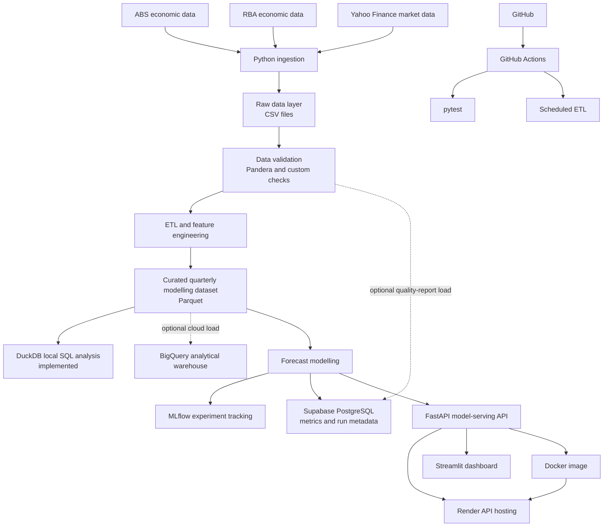

# CPI Forecasting Platform - Project Architecture

## 1. Portfolio Objective

This project extends a university Australian Consumer Price Index (CPI)
forecasting assignment into an end-to-end data science portfolio project.

The original assignment built a univariate SARIMA model using historical CPI
observations. The portfolio version keeps that statistical forecasting problem
at the centre, then expands the project into a reproducible forecasting
platform with data ingestion, ETL, validation, SQL analytics, multivariate
modelling, experiment tracking, API serving, dashboarding, testing, CI/CD, and
cloud deployment.

The goal is to demonstrate practical junior Data Scientist and Data Engineer
skills through one coherent project, not to add technology for its own sake.
Every platform in the architecture has a defined role.

## 2. Recruiter-Facing Summary

This project is being developed into an Australian inflation forecasting
platform using Python, ABS/RBA/market data ingestion, leakage-aware ETL,
validation, curated modelling datasets, SQL analytics, SARIMA/SARIMAX modelling,
walk-forward validation, MLflow experiment tracking, FastAPI model serving,
Docker, Streamlit, automated tests, GitHub Actions, and free-tier cloud
deployment.

Current implemented/scaffolded evidence includes reproducible data ingestion,
ETL, custom validation, Pandera validation, Parquet output, DuckDB analytical
loading, curated macro features, SQL query scaffolds, a baseline FastAPI
service, an initial Streamlit dashboard, Docker configuration, pytest tests,
and GitHub Actions workflows. Cloud services still require account-level
configuration before they should be described as deployed.

The project demonstrates:

- end-to-end data science workflow design
- reproducible multi-source economic data ingestion
- time-series forecasting and model evaluation
- feature engineering with macroeconomic indicators
- data validation and quality reporting
- SQL and cloud warehouse thinking
- backend API design for model serving
- interactive dashboard development
- containerised deployment
- CI/CD and scheduled pipeline automation

## 3. Core Forecasting Question

The project asks:

> Can Australian CPI forecasts be improved by combining historical CPI values
> with external macroeconomic indicators such as unemployment, wages, producer
> prices, interest rates, exchange rates, inflation expectations, commodity
> prices, and oil prices?

The model comparison will evaluate:

1. Seasonal naive benchmark
2. SARIMA
3. SARIMAX with external economic variables
4. Optional machine-learning benchmark using lagged features

Models will be evaluated using chronological walk-forward validation so the
forecasting setup reflects how the model would behave in practice.

## 4. Current Status vs Target Architecture

This distinction is important for portfolio credibility.

| Area | Current repository status | Target portfolio version |
|---|---|---|
| Baseline forecasting | Implemented in `cpi_forecast_V1.ipynb` | Refactored into reusable modelling modules |
| Data ingestion | Implemented in `data_retrieval.py` | Modular ingestion package with logging and tests |
| Data sources | ABS, RBA, yfinance data downloaded to `dataset/` | Same sources with scheduled refresh |
| Data manifest | Implemented as `dataset/download_manifest.json` | Used in data-quality and pipeline-run reporting |
| ETL | Implemented in `src/build_curated_dataset.py` | Extended with cloud loads after modelling |
| Validation | Implemented with custom checks and optional Pandera in `src/platform_validation.py` | Expand Pandera schemas later |
| SQL analytics | DuckDB load hook and SQL queries scaffolded | DuckDB locally, BigQuery in cloud |
| Application database | Schema and optional PostgreSQL quality-report load scaffolded | Supabase PostgreSQL for metrics and run metadata |
| Multivariate modelling | Planned | SARIMAX and optional Ridge benchmark |
| Experiment tracking | Dependency/config scaffolded | MLflow runs and model artifacts after model comparison |
| API | Implemented baseline FastAPI service in `api/main.py` | Replace baseline forecast with selected model |
| Dashboard | Implemented initial Streamlit app in `app/streamlit_app.py` | Add EDA and model-comparison pages |
| Deployment | Dockerfile scaffolded | Render API + Streamlit Community Cloud deployment |
| Automation | Implemented pytest files and GitHub Actions workflows | Confirm workflows after GitHub push |

## 5. High-Level Architecture



## 6. Architecture Principles

The project follows several design principles that are worth highlighting in a
job-search portfolio:

- Keep the statistical forecasting problem central.
- Use external indicators only when they can be justified economically.
- Avoid look-ahead bias in feature engineering and validation.
- Separate raw data, processed data, and curated modelling datasets.
- Track experiments so model comparisons are reproducible.
- Use SQL where it adds analytical value.
- Prefer simple cloud services over over-engineered infrastructure.
- Add tests around pipeline logic, transformations, and model outputs.
- Make the dashboard useful for exploration, not just decorative.
- Clearly document what is implemented versus planned.

## 7. Technology Stack

| Layer | Tools | Skill demonstrated |
|---|---|---|
| Language | Python | data science programming, modular design |
| Data retrieval | `readabs`, `yfinance`, `pandas` | API/library-based data ingestion |
| Data storage | CSV, Parquet | reproducible local data layers |
| Validation | custom checks, Pandera | defensive data engineering |
| Local analytics | DuckDB | SQL over local analytical files |
| Cloud warehouse | BigQuery optional load hook | GCP, analytical SQL, warehouse design |
| Relational store | Supabase PostgreSQL optional load hook | application metadata and relational modelling |
| Forecasting | statsmodels, pmdarima | SARIMA/SARIMAX, time-series modelling |
| ML benchmark | scikit-learn | lagged-feature regression baseline |
| Experiment tracking | MLflow | MLOps and reproducibility |
| API | FastAPI, Pydantic | backend development and model serving |
| Dashboard | Streamlit | interactive data product development |
| Testing | pytest | regression testing and reliability |
| Automation | GitHub Actions | CI/CD and scheduled jobs |
| Deployment | Docker, Render, Streamlit Cloud | containerisation and cloud deployment |
| Version control | Git, GitHub | professional software workflow |

## 8. Data Sources

### 8.1 Australian Bureau of Statistics

ABS data is retrieved through `readabs`.

Candidate variables:

- CPI index
- unemployment rate
- Wage Price Index
- Producer Price Index
- household spending

Portfolio value:

- official public data
- macroeconomic feature engineering
- handling mixed frequencies and publication structures
- reproducible ingestion from source systems

### 8.2 Reserve Bank of Australia

RBA data is retrieved through `readabs`.

Candidate variables:

- official cash rate
- AUD/USD exchange rate
- inflation expectations
- commodity price indexes

Portfolio value:

- monetary-policy indicators
- exchange-rate effects
- expected inflation signals
- external cost-pressure indicators

### 8.3 Yahoo Finance

Market data is retrieved through `yfinance`.

Candidate variables:

- WTI crude oil futures
- Brent crude oil futures

Portfolio value:

- market data ingestion
- daily-to-quarterly aggregation
- external commodity shock features

## 9. Existing Data Retrieval Pipeline

The current `data_retrieval.py` script is already a strong portfolio component.
It demonstrates more than a simple notebook download cell.

Implemented capabilities:

- command-line interface with inclusive start and end years
- configurable output directory
- ABS series retrieval by catalogue and series ID
- RBA table retrieval with series and metadata-based selection
- yfinance retrieval for WTI and Brent crude oil
- date filtering across PeriodIndex, DatetimeIndex, and date-column inputs
- flattened columns for clean CSV output
- metadata export for ABS/RBA sources
- row counts, column names, package versions, and timestamps in a manifest
- explicit input validation for year ranges
- error handling for failed source retrievals

Current output structure:

```text
dataset/
+-- abs/
|   +-- cpi_index_1995_2025.csv
|   +-- unemployment_rate_1995_2025.csv
|   +-- wage_price_index_1995_2025.csv
|   +-- producer_price_index_1995_2025.csv
|   +-- household_spending_1995_2025.csv
+-- rba/
|   +-- cash_rate_1995_2025.csv
|   +-- aud_usd_exchange_rate_1995_2025.csv
|   +-- inflation_expectations_1995_2025.csv
|   +-- commodity_prices_1995_2025.csv
+-- market/
|   +-- wti_crude_oil_1995_2025.csv
|   +-- brent_crude_oil_1995_2025.csv
+-- download_manifest.json
```

Example command:

```bash
python data_retrieval.py 1995 2025 --output-dir dataset
```

## 10. Implemented Data Pipeline

The current portfolio pipeline uses `dataset/` as the raw source layer produced
by `data_retrieval.py`, then creates processed and curated outputs under
`data/`.

```text
dataset/
+-- abs/
+-- rba/
+-- market/
+-- download_manifest.json

data/
+-- processed/
+-- curated/
+-- analytics/

reports/
+-- data_quality_report.csv
+-- platform_implementation_status.csv
```

### Raw Source Layer

Purpose:

- preserve downloaded source data
- make the pipeline auditable
- avoid manual edits to observations

Examples:

```text
dataset/abs/
dataset/rba/
dataset/market/
```

### Processed Layer

Purpose:

- standardise individual datasets
- clean dates and column names
- store source-specific transformed outputs

Common schema:

```text
date
variable
value
quarter
value
```

### Curated Layer

Purpose:

- create the final quarterly modelling table
- align all candidate predictors to CPI frequency
- apply leakage-aware transformations and lags

Example file:

```text
data/curated/quarterly_macro_features.csv
data/curated/quarterly_macro_features.parquet
```

### Analytics Layer

Purpose:

- load curated features and validation results into DuckDB
- provide a local SQL workflow before cloud warehousing

Implemented file:

```text
data/analytics/cpi_forecast.duckdb
```

## 11. ETL Design

### Extract

Download data from:

- ABS
- RBA
- Yahoo Finance

The extraction step should save source data and a manifest before any modelling
transformation is applied.

### Transform

Core transformations:

- parse and validate dates
- standardise column names
- remove duplicate observations
- convert monthly data to quarterly data
- aggregate daily market data to quarterly frequency
- calculate quarterly and year-ended inflation
- calculate growth rates for index variables
- create lagged economic indicators
- merge predictors into one modelling table
- avoid back-filling future information into past forecast origins

Example transformations:

```text
CPI index
-> quarterly CPI growth
-> year-ended CPI inflation

Wage Price Index
-> wage growth
-> lagged wage growth

WTI oil price
-> quarterly average
-> quarterly percentage change
-> lagged oil-price change

Cash rate
-> quarterly value
-> lag 1
-> lag 2
-> lag 4
```

### Load

The current ETL load stage writes to:

1. CSV for easy notebook use
2. Parquet for local modelling and analytics
3. DuckDB for local SQL exploration
4. a data-quality report CSV

Optional platform loads are implemented behind explicit flags:

```bash
python -m src.build_curated_dataset --load-bigquery
python -m src.build_curated_dataset --load-postgres
```

These require cloud credentials and environment variables before use.

## 12. Target Modelling Dataset

Candidate columns:

```text
quarter
cpi_index
cpi_qoq
cpi_yoy
unemployment_rate
wpi_growth
ppi_growth
household_spending_growth
cash_rate
aud_usd
aud_usd_change
inflation_expectations
commodity_growth
wti_growth
brent_growth
cash_rate_lag1
cash_rate_lag2
cash_rate_lag4
wpi_growth_lag1
wpi_growth_lag2
ppi_growth_lag1
oil_growth_lag1
```

Important rule:

Features must only use information that would have been known at the forecast
origin. This prevents look-ahead bias and makes the forecast evaluation more
credible.

## 13. Data Validation

Validation is now implemented in two layers.

### Custom Validation

`src/validation.py` validates raw, processed, and curated datasets with
transparent checks.

Implemented checks:

```text
required columns exist
date values are parseable
dates are unique
dates are sorted
numeric columns are numeric
unexpected empty datasets are rejected
CPI target values are not missing
duplicate quarters are rejected
quarterly modelling table has one row per quarter
lagged features do not alter row ordering
```

### Pandera Validation

`src/platform_validation.py` validates the curated modelling dataset using
Pandera. This makes the target validation platform part of the ETL run instead
of only a future plan.

### Quality Report

The ETL writes:

```text
reports/data_quality_report.csv
```

Current platform validation records include:

```text
pandera:curated_quarterly_macro_features   PASS
platform:duckdb                            PASS
```

Example report rows:

| Dataset | Status | Notes |
|---|---|---|
| CPI | PASS | Complete quarterly target |
| Unemployment | PASS | Monthly series converted to quarterly |
| WPI | PASS | Quarterly index converted to growth |
| PPI | PASS | Quarterly index converted to growth |
| Cash rate | PASS | Monthly values converted to quarterly |
| Inflation expectations | PASS | Business expectations series has full quarterly coverage |
| WTI | PASS | Daily prices aggregated to quarterly |
| Brent | PASS | Daily prices aggregated to quarterly |
| Household spending | WARNING | Shorter history than core predictors |
| Pandera curated schema | PASS | Required curated columns passed schema validation |
| DuckDB load | PASS | Curated data and validation report loaded locally |

Skills demonstrated:

- data quality engineering
- schema validation
- defensive programming
- trustworthy modelling inputs

## 14. Exploratory Data Analysis

The EDA should be statistically focused and leakage-aware.

Core EDA:

- data coverage by variable
- missingness by variable and time period
- CPI index plot
- quarterly inflation plot
- year-ended inflation plot
- external-indicator plots
- seasonal decomposition
- ACF and PACF analysis
- Augmented Dickey-Fuller stationarity tests
- optional KPSS stationarity tests
- lagged correlation analysis
- Granger causality screening
- predictor correlation matrix
- multicollinearity checks such as VIF
- structural-period review around COVID and the post-COVID inflation surge

EDA deliverables:

- variable coverage table
- transformation decisions
- candidate lag decisions
- shortlist of SARIMAX predictors
- notes on feature availability at forecast time

## 15. Feature Engineering

Candidate feature groups:

| Feature group | Variables | Economic rationale |
|---|---|---|
| CPI history | `cpi_lag1`, `cpi_lag4` | trend and quarterly seasonality |
| Labour market | unemployment, wage growth | demand and wage-pressure channels |
| Price pressure | PPI, commodity prices | upstream cost pressure |
| Monetary policy | cash rate and lags | delayed policy effect on inflation |
| Exchange rate | AUD/USD changes | imported inflation |
| Energy markets | WTI, Brent | fuel, transport, and production costs |
| Expectations | inflation expectations | forward-looking inflation behaviour |

Candidate lag features:

```text
cpi_lag1
cpi_lag4
cash_rate_lag1
cash_rate_lag2
cash_rate_lag4
wpi_growth_lag1
wpi_growth_lag2
ppi_growth_lag1
ppi_growth_lag2
aud_usd_change_lag1
commodity_growth_lag1
wti_growth_lag1
brent_growth_lag1
```

## 16. Forecasting Models

The project should use a small number of justified models.

### Model 1: Seasonal Naive

Purpose:

- simple benchmark
- difficult-to-beat baseline for seasonal economic data
- tests whether complex models add real value

### Model 2: SARIMA

The original notebook selected:

```text
SARIMA(0, 1, 1)(0, 1, 1)[4]
```

Purpose:

- captures CPI trend
- captures quarterly seasonality
- provides an interpretable statistical benchmark

### Model 3: SARIMAX

SARIMAX extends SARIMA by adding external variables.

Candidate variants:

```text
SARIMAX + labour variables
SARIMAX + price-pressure variables
SARIMAX + monetary variables
SARIMAX + commodity and oil variables
SARIMAX + selected combined predictors
```

Purpose:

- test whether external economic indicators improve CPI forecasts
- connect model performance to economic reasoning
- compare variable groups through ablation studies

### Optional Model 4: Ridge Regression

A Ridge regression model can use lagged CPI and macroeconomic features.

Purpose:

- provides a simple machine-learning benchmark
- handles correlated predictors better than plain linear regression
- demonstrates ML skills without forcing deep learning onto a small quarterly dataset

## 17. Model Evaluation

Time-series data should never be randomly shuffled for forecasting evaluation.

The project will use chronological walk-forward validation.

Metrics:

```text
RMSE
MAE
MSE
MAPE, if scale and zero-value constraints are appropriate
```

Evaluation should report both overall accuracy and accuracy by forecast horizon.

Example output:

| Model | Horizon | RMSE | MAE | Notes |
|---|---:|---:|---:|---|
| Seasonal naive | 1Q | ... | ... | benchmark |
| SARIMA | 1Q | ... | ... | univariate |
| SARIMAX | 1Q | ... | ... | selected predictors |
| SARIMAX | 4Q | ... | ... | selected predictors |
| SARIMAX | 8Q | ... | ... | selected predictors |

Additional diagnostics:

- residual autocorrelation
- residual normality review
- forecast interval coverage
- horizon-level error comparison
- ablation study by variable group

## 18. Experiment Tracking with MLflow

MLflow will track model runs and artifacts.

For each run, log:

```text
model name
model parameters
feature list
training window
test window
forecast horizon
validation strategy
RMSE
MAE
MSE
forecast plot
residual diagnostics
model artifact
```

Portfolio value:

- reproducible model comparison
- experiment management
- MLOps awareness
- clear evidence for why one model was selected

## 19. SQL and Data Storage

### DuckDB

DuckDB is now used by the ETL pipeline as the local analytical database.

Implemented database:

```text
data/analytics/cpi_forecast.duckdb
```

Implemented tables:

```text
quarterly_macro_features
data_quality_results
```

Example SQL:

```sql
SELECT
    quarter,
    cpi_yoy,
    unemployment_rate,
    cash_rate
FROM 'data/curated/quarterly_macro_features.parquet'
ORDER BY quarter;
```

Skills demonstrated:

- SQL
- analytical querying
- Parquet-based workflows

### BigQuery

BigQuery is implemented as an optional ETL load hook and remains a
configuration-required cloud target.

Example tables:

```text
cpi_raw
unemployment_raw
wpi_raw
ppi_raw
cash_rate_raw
exchange_rate_raw
quarterly_macro_features
```

Example analytical query:

```sql
SELECT
    EXTRACT(YEAR FROM quarter) AS year,
    AVG(cpi_yoy) AS avg_inflation,
    AVG(cash_rate) AS avg_cash_rate,
    AVG(unemployment_rate) AS avg_unemployment
FROM quarterly_macro_features
GROUP BY year
ORDER BY year;
```

Skills demonstrated:

- GCP exposure
- cloud data warehousing
- analytical SQL
- separation of modelling files from warehouse analytics

### Supabase PostgreSQL

Supabase PostgreSQL is scaffolded for application/model metadata and implemented
as an optional quality-report load hook.

Possible tables:

```text
pipeline_runs
data_quality_results
model_metrics
forecast_results
```

Example `model_metrics` table:

```text
model_name
run_id
run_date
forecast_horizon
feature_set
rmse
mae
mse
selected_model
```

Why both BigQuery and PostgreSQL?

| Platform | Role |
|---|---|
| BigQuery | analytical warehouse for economic datasets and SQL analysis |
| PostgreSQL | relational application store for runs, metrics, and forecast outputs |

This distinction demonstrates judgment about database workloads.

## 20. API Layer

FastAPI will expose model results and forecasts through a backend service.

Candidate endpoints:

```text
GET /health
GET /metrics
GET /features
GET /models
POST /forecast
```

Example forecast request:

```json
{
  "model": "sarimax",
  "horizon": 4,
  "features": ["wpi_growth_lag1", "ppi_growth_lag1", "cash_rate_lag2"]
}
```

Example forecast response:

```json
{
  "model": "sarimax",
  "horizon": 4,
  "forecast": [132.4, 133.1, 133.8, 134.2],
  "lower_ci": [130.8, 131.1, 131.6, 131.9],
  "upper_ci": [134.0, 135.1, 136.0, 136.5]
}
```

Skills demonstrated:

- REST API design
- backend development
- Pydantic schemas
- model serving
- separation between dashboard and modelling backend

## 21. Dashboard Layer

Streamlit will be the user-facing data product.

Recommended pages:

| Page | Purpose |
|---|---|
| Overview | project objective, latest model, headline metrics |
| Data Explorer | inspect available CPI, ABS, RBA, and market variables |
| Data Quality | show validation status, coverage, missingness, warnings |
| EDA | CPI trends, external indicators, correlations, stationarity outputs |
| Forecast | choose model, horizon, and predictors; view forecasts |
| Model Comparison | compare RMSE/MAE/MSE and selected feature sets |

The dashboard should call the FastAPI endpoint for forecasts rather than
fitting models directly in the UI. This demonstrates frontend/backend
separation while keeping the user experience simple.

Skills demonstrated:

- interactive analytics
- data storytelling
- dashboard design
- forecast visualisation
- integration with a model-serving API

## 22. Deployment Architecture

Suggested free-tier-friendly deployment:

```text
FastAPI
-> Docker
-> Render

Streamlit app
-> Streamlit Community Cloud

Curated analytics data
-> BigQuery

Application metadata
-> Supabase PostgreSQL

Testing and scheduled jobs
-> GitHub Actions
```

Free services can have quotas, inactivity delays, and policy changes. Before
final deployment, re-check each platform's current limits and suitability.

## 23. Testing Strategy

Testing should focus on high-risk project logic rather than chasing perfect
coverage.

Suggested test structure:

```text
tests/
+-- test_ingestion.py
+-- test_validation.py
+-- test_transformations.py
+-- test_features.py
+-- test_forecasting.py
+-- test_api.py
```

Important test cases:

- invalid year ranges are rejected
- missing date columns raise clear errors
- duplicate timestamps are detected
- monthly data converts to quarterly correctly
- daily prices aggregate to quarterly correctly
- lagged features do not use future observations
- modelling dataset has one row per quarter
- forecast horizon length is correct
- model metrics are calculated consistently
- API `/health` returns a successful response
- API `/forecast` returns the expected response schema

Skills demonstrated:

- pytest
- regression testing
- reliable data transformations
- API testing
- maintainable Python code

## 24. CI/CD and Scheduling

GitHub Actions will support two workflows.

### Continuous Integration

```text
Push or pull request
-> install Python
-> install dependencies
-> run formatting/lint checks, if configured
-> run pytest
-> report pass/fail
```

### Scheduled ETL

```text
Monthly schedule
-> run data retrieval
-> validate source data
-> build curated quarterly dataset
-> run tests
-> upload curated data to BigQuery
-> record pipeline run metadata
```

Skills demonstrated:

- CI/CD
- scheduled data workflows
- automation
- reproducible project operations

## 25. Logging and Observability

The pipeline should use Python's built-in `logging` library.

Example log messages:

```text
INFO Downloading ABS CPI series
INFO Saving raw RBA cash-rate data
WARNING Inflation expectations has missing observations
INFO Building quarterly modelling dataset
INFO Running SARIMAX walk-forward validation
ERROR BigQuery upload failed
```

Additional observability artifacts:

- download manifest
- data quality report
- pipeline run table
- MLflow experiment runs
- API logs from hosted deployment

## 26. Proposed Repository Structure

Target structure:

```text
cpi-forecast/
+-- app/
|   +-- streamlit_app.py
+-- api/
|   +-- main.py
|   +-- schemas.py
+-- src/
|   +-- ingestion/
|   |   +-- abs.py
|   |   +-- rba.py
|   |   +-- market.py
|   +-- validation/
|   |   +-- data_quality.py
|   +-- transformation/
|   |   +-- clean.py
|   |   +-- resample.py
|   |   +-- merge.py
|   +-- features/
|   |   +-- build_features.py
|   +-- models/
|   |   +-- seasonal_naive.py
|   |   +-- sarima.py
|   |   +-- sarimax.py
|   |   +-- ridge.py
|   +-- evaluation/
|       +-- backtesting.py
+-- sql/
|   +-- schema.sql
|   +-- queries/
+-- data/
|   +-- raw/
|   +-- processed/
|   +-- curated/
+-- notebooks/
|   +-- cpi_forecast_V1.ipynb
|   +-- exploratory_analysis.ipynb
+-- tests/
+-- .github/
|   +-- workflows/
|       +-- tests.yml
|       +-- scheduled_etl.yml
+-- Dockerfile
+-- requirements.txt
+-- README.md
+-- PROJECT_ARCHITECTURE.md
+-- .env.example
```

## 27. Implementation Roadmap

### Phase 1: Data Pipeline Foundation

Deliverables:

- refactor `data_retrieval.py` into reusable ingestion modules
- create raw, processed, and curated data layers
- standardise source schemas
- convert all variables to quarterly frequency
- create the curated modelling dataset
- save output as Parquet
- add manifest and logging

Portfolio outcome:

One command can rebuild the modelling dataset from public data sources.

### Phase 2: Validation and EDA

Deliverables:

- Pandera validation schemas
- data quality report
- coverage and missingness table
- CPI and predictor EDA plots
- stationarity tests
- lag-correlation analysis
- feature availability audit

Portfolio outcome:

The project shows that modelling choices are based on evidence, not blind
feature addition.

### Phase 3: Forecast Modelling

Deliverables:

- seasonal naive benchmark
- refactored SARIMA baseline
- SARIMAX feature-group experiments
- optional Ridge regression benchmark
- walk-forward validation
- horizon-level metrics
- residual diagnostics

Portfolio outcome:

The project proves whether external indicators improve CPI forecasts.

### Phase 4: MLOps and Storage

Deliverables:

- MLflow experiment tracking
- model artifacts
- model metrics table
- forecast results table
- BigQuery upload for curated analytical data
- DuckDB local SQL examples

Portfolio outcome:

The project demonstrates reproducible experiment management and SQL analytics.

### Phase 5: API and Dashboard

Deliverables:

- FastAPI `/health`, `/models`, `/metrics`, and `/forecast` endpoints
- Streamlit dashboard pages
- API/dashboard integration
- Dockerfile
- Render API deployment
- Streamlit Cloud deployment

Portfolio outcome:

The model becomes an interactive data product rather than a notebook-only
analysis.

### Phase 6: Testing and Automation

Deliverables:

- pytest suite for pipeline, features, models, and API
- GitHub Actions CI workflow
- scheduled ETL workflow
- updated README with setup, architecture, and results

Portfolio outcome:

The repository looks like maintainable software, not only coursework.

## 28. Minimum Viable Portfolio Version

The project can be considered portfolio-ready when the following works:

- data can be downloaded automatically
- raw source data is preserved
- key datasets are validated
- all variables are transformed to quarterly frequency
- a curated modelling dataset is generated
- DuckDB or BigQuery SQL examples work
- seasonal naive, SARIMA, and SARIMAX are compared
- walk-forward validation produces model metrics
- MLflow records experiments
- FastAPI returns forecast outputs
- Streamlit displays data, metrics, and forecasts
- pytest covers important transformation and modelling logic
- GitHub Actions runs tests
- README explains results and how to run the project

## 29. Technologies Intentionally Excluded

The MVP should not add these unless there is a clear reason:

```text
Kubernetes
Apache Spark
Kafka
Airflow
Terraform
Databricks
SageMaker
deep learning transformers
real-time streaming
complex microservices
OAuth
automated model-drift retraining
```

Reason:

The dataset is small, quarterly, and public. The strongest portfolio signal is
sound modelling and clean engineering judgment, not excessive infrastructure.

## 30. Skill Evidence Map

| Skill category | Evidence in this project |
|---|---|
| Python | CLI data retrieval, modular ETL, modelling code, API, dashboard |
| Data wrangling | date parsing, frequency conversion, merging, lag generation |
| Time-series forecasting | SARIMA, SARIMAX, seasonality, stationarity, backtesting |
| Econometrics | macroeconomic feature rationale, lag relationships, Granger screening |
| Machine learning | optional Ridge benchmark with lagged predictors |
| Data engineering | raw/processed/curated layers, manifests, validation, Parquet |
| SQL | DuckDB queries, BigQuery warehouse tables, aggregation queries |
| Cloud | BigQuery, Supabase, Render, Streamlit Cloud |
| Backend | FastAPI forecast service and response schemas |
| Frontend/data product | Streamlit dashboard for exploration and forecasts |
| MLOps | MLflow runs, model artifacts, metrics tracking |
| Testing | pytest coverage for data, features, models, API |
| Automation | GitHub Actions CI and scheduled ETL |
| Deployment | Dockerised API and hosted dashboard |
| Communication | README, architecture diagram, model results, portfolio narrative |

## 31. Final Portfolio Story

The project should communicate this progression:

```text
University SARIMA assignment
-> reproducible public-data ingestion
-> multi-source macroeconomic dataset
-> validation and leakage-aware ETL
-> curated quarterly modelling table
-> SARIMA/SARIMAX/Ridge comparison
-> walk-forward validation
-> MLflow experiment tracking
-> SQL analytics and cloud storage
-> FastAPI model serving
-> Streamlit dashboard
-> Docker deployment
-> GitHub Actions testing and scheduled pipeline
```

Instead of presenting the project only as:

> Built a SARIMA model to forecast CPI.

the finished project can be presented as:

> Built an end-to-end Australian inflation forecasting platform that combines
> public macroeconomic data ingestion, validated ETL, time-series modelling,
> experiment tracking, SQL analytics, API model serving, dashboarding, testing,
> and cloud deployment.

That story is strong because it shows both modelling ability and the engineering
skills needed to turn analysis into a usable data product.
