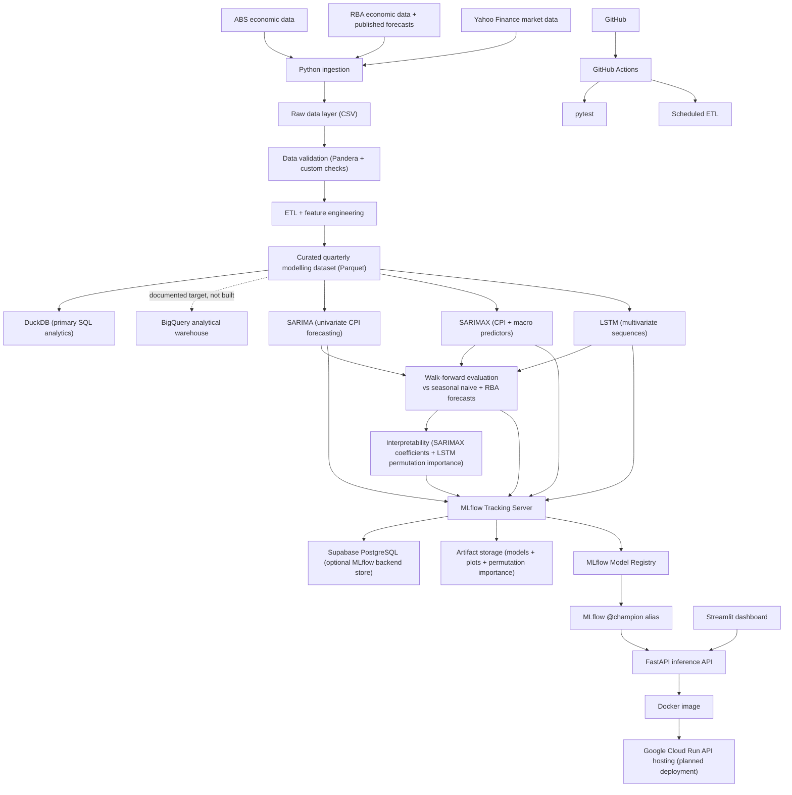

# CPI Forecast

An Australian Consumer Price Index (CPI) forecasting project, originally a
university time-series assignment, now being extended into an end-to-end data
science portfolio project. The original notebook,
`notebooks/cpi_forecast_V1.ipynb`, builds and evaluates a quarterly SARIMA
model using historical CPI observations from 1995 Q1 to 2022 Q4.

This document is the single source of truth for the project's story, status,
architecture decisions, and setup instructions (it replaces the previous
split between `README.md` and `PROJECT_ARCHITECTURE.md`).

## Core Question

> Can Australian CPI forecasts be improved by combining historical CPI values
> with external macroeconomic indicators such as unemployment, wages, producer
> prices, interest rates, exchange rates, inflation expectations, commodity
> prices, and oil prices -- and how do those forecasts compare to the RBA's
> own published inflation projections?

The portfolio version compares **three primary forecasting models** against
**two benchmarks**. Neither benchmark counts as one of the three primary
models.

| Role | Model | Type | Main inputs |
|---|---|---|---|
| Benchmark | Seasonal naive | statistical reference | CPI history |
| Benchmark | RBA published inflation forecast | institutional forecast | RBA's own projections |
| Primary 1 | SARIMA | univariate statistical | CPI history |
| Primary 2 | SARIMAX | multivariate statistical | CPI + selected macro indicators |
| Primary 3 | LSTM | multivariate deep learning | sequences of CPI + selected macro indicators |

**Why two benchmarks:** beating seasonal naive is a low bar for an inflation
model -- almost any reasonable model clears it. The RBA publishes its own
inflation forecasts, so comparing SARIMA/SARIMAX/LSTM against those tests
whether the project's models are competitive with a real professional
forecaster who has access to policy intentions, business liaison data, and
analyst judgment the statistical models don't see. The project reports
honestly if that bar isn't cleared.

The project is organised around three "flagship" deliverables, one per data
role, so each pillar is demonstrated deeply rather than every pillar being
demonstrated shallowly:

| Pillar | Flagship deliverable | Supporting evidence |
|---|---|---|
| Data Science | SARIMA vs SARIMAX vs LSTM, walk-forward validated against seasonal naive **and** the RBA forecast, with SARIMAX coefficient and LSTM permutation-importance interpretability | EDA notebook, feature engineering |
| Data Engineering | Ingestion -> validation -> curated Parquet -> DuckDB, fully local and credential-free | BigQuery documented as target, not deployed |
| ML Engineering | MLflow runs, model registry with `@champion`, FastAPI selected-model serving, Docker, and planned Google Cloud Run deployment | Postgres as the optional MLflow backend and run metadata store |

## What `cpi_forecast_V1.ipynb` Found

The notebook follows a complete forecasting workflow: load and clean
`CPI_train.csv`, build a quarterly time-series index, run EDA (time-series
plots, boxplots, seasonal decomposition), test stationarity with ACF/PACF/ADF,
apply first-order and seasonal (lag 4) differencing, search for a SARIMA
specification with `pmdarima.auto_arima`, validate against a seasonal naive
benchmark using rolling-window validation, and produce out-of-sample forecasts
with confidence intervals. The selected model is:

```text
SARIMA(0, 1, 1)(0, 1, 1)[4]
```

This fits the series well because CPI has a clear upward trend (removed by
first differencing) and a repeating quarterly seasonal pattern (removed by
seasonal differencing at lag 4). SARIMA slightly improved on the seasonal
naive benchmark during rolling validation: on the 8-quarter test period it
achieved a test MSE of about `46.25` and RMSE of about `6.8` CPI points.
Residual diagnostics show no strong remaining autocorrelation, approximately
normal residuals, and no obvious remaining trend.

**Note on benchmarking:** these notebook results are only compared against
seasonal naive, since `cpi_forecast_V1.ipynb` predates the platform's
walk-forward evaluation harness. The project-wide SARIMA/SARIMAX/LSTM
comparison against seasonal naive **and** the RBA forecast is now implemented
(see [Models In Detail](#models-in-detail) and `reports/model_comparison_sarima.csv`,
`reports/model_comparison_sarimax.csv`, `reports/model_comparison_lstm.csv`).

## Models In Detail

### SARIMA (implemented, baseline)

The existing SARIMA model remains the univariate statistical baseline,
providing a clean reference for measuring the value external predictors add.

### SARIMAX (implemented)

SARIMAX extends SARIMA with economically justified lagged predictors selected
through the EDA and feature-availability audit (unemployment, PPI growth,
cash rate, commodity/oil prices, inflation expectations). Fixed feature-group
ablations are reported in `reports/model_comparison_sarimax.csv`; order and
level-vs-change choices are made before walk-forward evaluation, not tuned
against backtest RMSE/MAE.

**Interpretability:** fitted coefficients are reported in
`reports/sarimax_coefficients.csv` alongside accuracy metrics, with a check
that each sign matches basic macroeconomic expectations. A coefficient that
contradicts theory is worth flagging, not hiding.

### LSTM (implemented)

A compact TensorFlow/Keras LSTM is included as a deep-learning **challenger**,
not an assumed winner. It uses the same core predictor set as SARIMAX Group D
plus `cpi_yoy` history, so the comparison reflects modelling approach rather
than differing information sets. Architecture stays deliberately small and
fixed: one LSTM layer with 16 hidden units, dropout 0.2, an 8-quarter lookback,
and a dense direct 8-quarter output layer.

The quarterly sample is small -- about 120-125 observations from 1995 onward
before sequence construction and train/test splitting -- which risks
overfitting. To keep the comparison credible: all models use the same
chronological evaluation periods; the LSTM scaler is fit on training data
only; validation/test observations never influence preprocessing; early
stopping and regularisation are used; results are reported by forecast
horizon; and worse LSTM performance is treated as an informative result, not
a failed experiment.

**Interpretability:** permutation importance is reported in
`reports/lstm_permutation_importance.csv` from one separate interpretation
model on a chronological held-out tail. Negative RMSE increases are treated as
small-sample instability/no robust positive importance, not as strong evidence
that a feature is beneficially harmful. Agreement with SARIMAX coefficients
strengthens confidence in which predictors actually matter; disagreement is
itself worth discussing.

A useful research framing:

> How does forecasting performance change as the project moves from
> univariate statistical modelling (SARIMA), to multivariate statistical
> modelling (SARIMAX), to nonlinear sequence modelling (LSTM) -- and does any
> of that added complexity close the gap to the RBA's own forecast accuracy?

## Architecture Decisions

This project deliberately does **not** wire up every platform a data role
might touch. Each tool has a specific, defensible job; anything without a
clear job is documented as a target rather than built.

| Decision | Reasoning |
|---|---|
| DuckDB is the built SQL/analytics layer; BigQuery is a documented target, not deployed | The curated dataset is ~125 quarterly rows read from a local Parquet file. A managed cloud warehouse adds real value at higher data volume or concurrency, neither of which applies yet. |
| Supabase PostgreSQL holds MLflow backend and application run metadata, not a second copy of the curated dataset | Two databases holding the same data demonstrates nothing new. Postgres gets a distinct job: storing experiment/run metadata queryable from the dashboard, while artifacts stay in MLflow artifact storage. |
| MLflow + FastAPI + Docker + Google Cloud Run is the flagship deployment path | This combination produces something clickable once deployed -- a tracked, served model -- rather than partially-configured infrastructure. Cloud Run's usage-based free tier (scale-to-zero, configurable container memory) gives more headroom for the TensorFlow/statsmodels image than a fixed 512MB always-on free tier does. |
| Kubernetes, Terraform, Spark, Kafka, Airflow are excluded | None solve a problem this project actually has: one small model, a handful of requests, no elastic-scaling requirement. |
| A second benchmark (RBA's own published forecast) was added alongside seasonal naive | Beating seasonal naive is a low bar for an inflation model. Comparing against a real institutional forecaster is the bar that actually matters, and the project reports honestly if it isn't cleared. |

## Technology Stack

| Layer | Tools | Skill demonstrated |
|---|---|---|
| Language | Python | data science programming, modular design |
| Data retrieval | `readabs`, `yfinance`, `pandas` | API/library-based ingestion |
| Data storage | CSV, Parquet | reproducible local data layers |
| Validation | custom checks, Pandera | defensive data engineering |
| Local analytics (flagship) | DuckDB | SQL over local analytical files |
| Cloud warehouse | BigQuery -- documented target, optional load hook | warehouse design judgment |
| Relational store | Supabase PostgreSQL -- run/metrics metadata | scoped relational modelling |
| Statistical forecasting | statsmodels, pmdarima | SARIMA/SARIMAX |
| Deep learning | TensorFlow, Keras | LSTM sequence modelling |
| Interpretability | Permutation importance, statsmodels coefficient summaries | model explainability |
| Experiment tracking (flagship) | MLflow | MLOps and reproducibility |
| API (flagship) | FastAPI, Pydantic | backend model serving |
| Dashboard | Streamlit | interactive data product development |
| Testing | pytest | regression testing |
| Automation | GitHub Actions | CI/CD and scheduled jobs |
| Deployment (flagship) | Docker, Google Cloud Run | containerisation and cloud deployment |

## Implementation Status

| Platform | Status | Flagship? | Evidence |
|---|---|---|---|
| Data retrieval (ABS/RBA/market + RBA forecast history) | implemented | | `data_retrieval.py`, `dataset/` |
| ETL | implemented | | `src/build_curated_dataset.py` |
| Data validation (custom + Pandera) | implemented | | `src/validation.py`, `src/platform_validation.py` |
| Parquet | implemented | | `data/curated/quarterly_macro_features.parquet` |
| DuckDB/SQL analytics | implemented | **DE flagship** | `data/analytics/cpi_forecast.duckdb`, `src/platform_loads.py`, `sql/queries/` |
| EDA | implemented, 14 sections | | `notebooks/EDA.ipynb` |
| BigQuery | documented target only, optional load hook, not deployed | | `src/platform_loads.py`, `.env.example` |
| Supabase PostgreSQL | schema scaffolded, scoped to MLflow backend + run metadata | supporting for MLE flagship | `sql/schema_app_metadata.sql`, `.env.example` |
| SARIMA | implemented | **DS flagship** | `notebooks/cpi_forecast_V1.ipynb`, `src/models/sarima.py` |
| SARIMAX / LSTM comparison + RBA benchmark | implemented | **DS flagship** | `src/models/`, `reports/model_comparison_sarimax.csv`, `reports/model_comparison_lstm.csv`, `reports/lstm_permutation_importance.csv` |
| MLflow | implemented locally: comparison runs log params, metrics, report artifacts, and full-sample model artifacts | **MLE flagship** | `src/models/tracking.py`, `mlruns/` (local, gitignored) |
| FastAPI | implemented locally: MLflow `@champion` `/models`, `/metrics`, and `/forecast` serving; deployment planned | **MLE flagship** | `api/main.py`, `src/models/registry.py`, local `uvicorn` check |
| Docker / Google Cloud Run | containerized; SARIMA champion path verified locally, LSTM unverified; live Cloud Run deployment pending | **MLE flagship** | `Dockerfile`, `.dockerignore`, local container `/forecast` check |
| Streamlit | multipage dashboard implemented for overview, data exploration, and static EDA summaries | supporting | `app/streamlit_app.py`, `app/pages/` |
| GitHub Actions | CI + scheduled ETL scaffolded | supporting | `.github/workflows/` |

Cloud services such as Supabase and Google Cloud Run still require account setup,
credentials, and deployment configuration. BigQuery is intentionally not on
that path yet (see Architecture Decisions above). The repository contains the
code/configuration entry points, but nothing should be described as deployed
until public URLs and credentials are configured and verified.

## Data Retrieval

`data_retrieval.py` is a reproducible pipeline for downloading Australian
macroeconomic and market indicators, separate from the original modelling
notebook. It downloads from ABS (`readabs`), RBA (`readabs`), and market data
(`yfinance`), saving under `dataset/{abs,rba,market}/` plus a
`download_manifest.json` recording download time, package versions, year
range, output files, row counts, and column names.

Retrieved series:

- CPI index, unemployment rate, wage price index, producer price index, household spending (ABS)
- RBA cash rate, AUD/USD exchange rate, inflation expectations, commodity price indexes (RBA)
- WTI and Brent crude oil futures (market)

**RBA historical CPI forecasts by horizon (newly implemented):**
`data_retrieval.py` now downloads the RBA's published `cpi-by-horizon.xls`
workbook, tidies its Forecasts/Actuals/Errors sheets into one table keyed by
`forecast_date`, `horizon_label`, and `horizon_quarters`, and saves it to
`dataset/rba/rba_historical_cpi_forecasts_by_horizon_<start>_<end>.csv` with
columns `rba_forecast_cpi_yoy`, `rba_actual_cpi_yoy`, and
`rba_forecast_error_cpi_yoy`. This is the reproducible source for the second
benchmark described in [Core Question](#core-question) -- it replaces what
was previously a "planned addition" pasted-in manually.

```bash
python -m pip install -r requirements-data.txt
python data_retrieval.py 1995 2025 --output-dir dataset
```

## ETL And Feature Engineering

`src/build_curated_dataset.py` validates the raw ABS/RBA/market CSVs,
converts monthly/quarterly/daily series to quarterly frequency, builds CPI
inflation/growth-rate/lagged predictor features (`src/features.py`), merges
everything into one modelling table, validates the curated output (custom
checks + Pandera when installed), attempts a DuckDB analytical load, and
writes a data-quality report.

**Rate-change features:** `src/features.py` adds `cash_rate_change` and
`unemployment_rate_change` (percentage-point differences, via
`add_growth_rates`) alongside their lagged versions (`cash_rate_change_lag1`,
`unemployment_rate_change_lag1/lag2`) and `household_spending_growth_lag1`,
covered by `tests/test_features.py`. The curated dataset has been regenerated
and these features are already consumed by SARIMAX Group D and the LSTM
baseline (see [Models In Detail](#models-in-detail)).

```bash
python -m src.build_curated_dataset
```

Outputs:

```text
data/processed/
data/curated/quarterly_macro_features.csv
data/curated/quarterly_macro_features.parquet
data/analytics/cpi_forecast.duckdb
reports/data_quality_report.csv
```

The Parquet output requires `pyarrow`; Pandera and DuckDB are optional local
platform dependencies -- if one is missing, the pipeline records a warning and
continues with CSV output and custom validation. Optional, stretch-goal cloud
loads (documented target architecture, not required for the MVP):

```bash
python -m src.build_curated_dataset --load-bigquery
python -m src.build_curated_dataset --load-postgres
```

`--load-postgres` writes run/metrics metadata, not a duplicate of the curated
dataset. Both require the relevant environment variables in `.env.example`.

### Data Validation

`src/validation.py` runs custom checks (required columns exist, dates
parseable/unique/sorted, numeric columns are numeric, no unexpected empty
datasets, CPI target not missing, one row per quarter, lagged features don't
reorder rows). `src/platform_validation.py` adds Pandera schema validation for
the curated table. Results are written to `reports/data_quality_report.csv`.

## Exploratory Data Analysis

`notebooks/EDA.ipynb` is a leakage-aware EDA pass over
`data/curated/quarterly_macro_features.csv`/`.parquet`, needed because the
ETL aligns originally monthly, quarterly, and daily series into one quarterly
table, and the resulting predictors need a stationarity, lead-lag, and
forecast-origin-availability screen before they can be trusted in SARIMAX.
The notebook now has **14 sections**, all implemented:

1. Data integrity checks (duplicate timestamps, monotonic index, expected frequency)
2. Missing values and usable-history coverage per variable
3. CPI target inspection (index, QoQ, YoY, trend/seasonality/volatility/structural breaks)
4. **CPI seasonal decomposition and ACF/PACF diagnostics** (newly implemented) -- STL trend/seasonal/residual split plus ACF/PACF on CPI YoY and differenced CPI, to inform SARIMA/SARIMAX order selection
5. External variable inspection (scale, distribution, outliers, economic interpretation)
6. Stationarity tests (ADF + KPSS, guiding levels/differences/log-changes per variable)
7. Lead-lag correlation analysis (cross-correlation at 1/2/4-quarter lags)
8. Granger causality screening (predictive-value screen, not structural causality)
9. Multicollinearity and VIF
10. Leakage and forecast-origin availability assumptions (backed by `data/metadata/series_availability.csv`)
11. Candidate exogenous feature screening for SARIMAX (screening-stage shortlist, not final selection)
12. **Rolling correlations / relationship stability** (newly implemented) -- checks whether CPI-predictor relationships are stable through time or only strong during unusual periods
13. **Raw source frequency validation spot check** (newly implemented) -- reconciles two representative raw inputs against the curated quarterly values using the ETL's own `to_quarterly()` rule, as a light audit rather than a full raw-source review
14. **RBA forecast error benchmark preparation** (newly implemented) -- summarises the newly retrieved RBA historical CPI forecast errors by horizon, as benchmark preparation for the modelling stage

**Remaining follow-ups documented in the notebook:**

- The rolling-origin SARIMA/SARIMAX/LSTM-vs-RBA comparison the notebook's
  RBA forecast-error summary was preparing for is now implemented (see
  [Models In Detail](#models-in-detail)).
- `data/metadata/series_availability.csv` is an assumption-backed
  forecast-origin lag table, not official release-calendar metadata, since
  the project currently uses revised historical data rather than real-time
  vintages.
- LSTM input selection is intentionally out of scope for the Section 11
  SARIMAX shortlist; sequence models handle correlated/nonlinear predictors
  differently and will be screened separately, mindful of the ~124-observation
  sample size.

## Advanced Forecasting Ideas From Recent Literature

Peng et al. (2025) propose MSP-EDA, a multivariate forecasting framework
combining multiscale patch representations (Fourier for global periodicity,
wavelets for local time-frequency variation) with attention-based external
data augmentation. The full architecture is likely too complex for this
project's small quarterly sample, but several ideas remain useful and map onto
work already underway or planned:

- **Multiscale CPI analysis** -- quarterly, YoY, rolling 2/4-year averages (partly covered by EDA sections 3-4).
- **Frequency-domain diagnostics** -- Fourier/periodogram confirmation of quarterly seasonality (partly covered by the new STL/ACF-PACF section).
- **External-data quality score** -- score each predictor on coverage, missingness, frequency alignment, publication delay, and economic relevance before modelling.
- **Horizon-level evaluation** -- report accuracy by forecast horizon (1Q..8Q), not only overall RMSE.
- **Ablation studies by variable group** -- labour market, price-pressure, monetary/exchange-rate, commodity/oil, combined.
- **Cross-variable relationship diagnostics** -- lag correlations, Granger tests, VIF, and coefficient interpretation as an interpretable stand-in for attention-based relationship learning.

## High-Level Architecture

The flow is MLflow-centred: model training and walk-forward evaluation
produce tracked runs, artifacts, and registry candidates; only the selected
champion model is promoted to the serving path, keeping the API focused on
inference rather than training logic.



## API, Dashboard, And Deployment

**Streamlit** is the interactive UI, and **FastAPI** the model-serving
backend behind it -- both are part of the plan together, not an either/or
choice. Streamlit fits exploration, EDA, and model comparison since this is
primarily a data science project; FastAPI fits serving the selected model as
a reusable endpoint. Streamlit calls FastAPI rather than fitting models
directly in the UI, keeping model logic in one place.

Implemented FastAPI endpoints (`api/main.py`):

```text
GET  /health
GET  /metrics
GET  /features
GET  /models
POST /forecast
```

Implemented Streamlit pages: Overview, Data Explorer, EDA Dashboard. Planned
Streamlit pages: Forecasting Interface (model/horizon/feature selection with
confidence intervals), and Model Evaluation (RMSE/MAE/MSE, benchmark
comparisons, residual diagnostics, permutation-importance/coefficient interpretability).

Container deployment path: FastAPI -> Docker image -> Google Cloud Run
(planned, to be linked here once verified live). The MLflow champion currently
lives in the local gitignored `mlruns/` file store, so the Docker image must be
built from a local checkout that already contains a promoted champion
snapshot:

```bash
python -m src.models.evaluation
python -m src.models.sarimax_order_search
python -m src.models.lstm
python -m src.models.registry

docker build -t cpi-forecast-api:latest .
docker run --rm -d --name cpi-forecast-api -p 8000:8000 cpi-forecast-api:latest
curl http://127.0.0.1:8000/health
curl http://127.0.0.1:8000/models
curl http://127.0.0.1:8000/metrics
curl -X POST http://127.0.0.1:8000/forecast \
  -H "Content-Type: application/json" \
  -d '{"horizon":4}'
docker stop cpi-forecast-api

gcloud auth configure-docker <region>-docker.pkg.dev
docker tag cpi-forecast-api:latest <region>-docker.pkg.dev/<project-id>/<repo>/cpi-forecast-api:latest
docker push <region>-docker.pkg.dev/<project-id>/<repo>/cpi-forecast-api:latest
```

Then deploy the pushed image directly (no git-triggered build):

```bash
gcloud run deploy cpi-forecast-api \
  --image <region>-docker.pkg.dev/<project-id>/<repo>/cpi-forecast-api:latest \
  --memory 2Gi \
  --allow-unauthenticated
```

Do not use a git-triggered build for this version: a fresh `git clone` will
not include `mlruns/` (it's gitignored), so the champion alias and model
artifacts would be missing. Deploying the pre-built image intentionally bakes
the current local MLflow run history into the image, not only the champion;
that is an accepted tradeoff at this project's scale. The Dockerfile rewrites
absolute local `mlruns/` artifact paths to `/app/mlruns` during image build so
the baked MLflow file store resolves inside the container. Cloud Run injects
a `PORT` environment variable and expects the container to listen on it, which
the Dockerfile's `CMD` respects.

Streamlit -> Streamlit Community Cloud. DuckDB stays local; Supabase
PostgreSQL is optional and scoped to run/metrics metadata only. GitHub Actions
runs tests and the scheduled ETL.

## Repository Structure

```text
.
+-- notebooks/
|   +-- cpi_forecast_V1.ipynb       # Main university forecasting notebook
|   +-- EDA.ipynb                   # Leakage-aware EDA, 14 sections
|   +-- CPI_train.csv               # Original CPI training data
|   +-- CPI_forecast.csv            # Forecast output from the notebook
+-- dataset/                        # Downloaded ABS, RBA, and market datasets
+-- data/
|   +-- processed/                  # Quarterly individual series
|   +-- curated/                    # Final modelling dataset
|   +-- analytics/                  # DuckDB database
|   +-- metadata/                   # series_availability.csv
+-- reports/                        # Data quality and platform status reports
+-- src/                            # ETL, validation, feature, and status code
+-- tests/                          # Validation/transform/feature tests
+-- api/                            # FastAPI model-serving service
+-- app/                            # Streamlit dashboard
+-- sql/                            # SQL queries and metadata schema
+-- .github/workflows/              # CI and scheduled ETL workflows
+-- data_retrieval.py
+-- requirements-data.txt
+-- requirements.txt
+-- Dockerfile
+-- README.md
```

## Running The Project

```bash
# data retrieval (network access required)
python -m pip install -r requirements-data.txt
python data_retrieval.py 1995 2025 --output-dir dataset

# ETL + validation
python -m src.build_curated_dataset

# tests
python -m pytest tests

# platform status report
python -m src.platform_status

# API
uvicorn api.main:app --reload

# dashboard
streamlit run app/streamlit_app.py
```

## Roadmap

The Data Science flagship (item 1) is done; the project now moves into the
other two flagship pillars, with dashboard polish last.

1. **Data Science flagship (done):** SARIMA, SARIMAX (feature-group
   ablations, coefficient interpretation), and a compact leakage-safe LSTM
   (permutation importance) are all walk-forward validated against seasonal
   naive **and** the RBA benchmark, reported overall and by horizon --
   `src/models/`, `reports/model_comparison_*.csv`.
2. **ML Engineering flagship (next):** log every run (params, features, horizon,
   metrics, and LSTM-specific settings) in MLflow; serve the selected model
   through FastAPI (`/health`, `/models`, `/metrics`, `/forecast`);
   containerise with Docker; deploy to Google Cloud Run.
3. **Data Engineering flagship:** confirm DuckDB SQL examples against the
   regenerated curated dataset; add the Postgres run/metrics metadata store;
   confirm GitHub Actions CI and scheduled ETL after pushing.
4. **Supporting polish:** build out the Streamlit EDA/forecast/comparison
   pages, calling the FastAPI endpoint rather than fitting models in the UI.

The result should read as a coherent, intentionally-scoped platform: a
university SARIMA assignment extended into reproducible ingestion (including
a real forecaster's own predictions), leakage-aware ETL, a SARIMA/SARIMAX/LSTM
comparison against both seasonal naive and the RBA, real MLflow tracking,
FastAPI serving, a Streamlit dashboard, Docker/Cloud Run deployment, and CI --
with explicit, written reasoning for every tool included and excluded, rather
than a checklist of every tool in a data science job posting.

## Explicitly Excluded Technologies

Not added unless a clear reason emerges: Kubernetes, Apache Spark, Kafka,
Airflow, Terraform, Databricks, SageMaker, large transformer-based
forecasting architectures, real-time streaming, complex microservices, OAuth,
automated model-drift retraining, and a second full data warehouse alongside
DuckDB. The dataset is small, quarterly, and public -- the strongest
portfolio signal is sound modelling and clean engineering judgment, not
excessive infrastructure, and explicitly excluding tools (and saying why) is
itself evidence of that judgment.

## References

Peng, S., Sun, W., Chen, P., Xu, H., Ma, D., Chen, M., Wang, Y., & Li, H.
(2025). MSP-EDA: Multivariate time series forecasting based on multiscale
patches and external data augmentation. *Electronics, 14*(13), 2618.
https://doi.org/10.3390/electronics14132618
