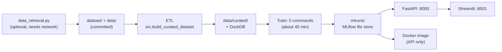

# CPI Forecast

[](https://juanvu1810.github.io/CPI-Forecast/intro.html#ai-acknowledgement) [](https://juanvu1810.github.io/CPI-Forecast/intro.html#ai-acknowledgement)

Australian year-ended CPI inflation forecasting, taken from a university
time-series assignment to an end-to-end project: reproducible data retrieval
and ETL, SARIMA / Elastic Net / Ensemble models walk-forward validated
against seasonal naive and the RBA's own forecasts, a structural VAR with a
scenario engine, an RBA policy-action classifier, an illustrative credit-stress
test, and a FastAPI + Streamlit app with a Cloud Run deployment.

**Live links** (nothing to install):

| | |
|---|---|
| Interactive demo | https://cpi-forecast-demo.streamlit.app/ |
| Jupyter Book (results and methodology) | https://juanvu1810.github.io/CPI-Forecast/ |
| Forecast API docs | https://cpi-forecast-api-887232555982.asia-southeast1.run.app/docs |
| Source code | https://github.com/JuanVu1810/CPI-Forecast |

Start the book with *Key Findings*. The demo lets you run a live forecast, watch the
Ensemble's simulated paths, try your own shock in the scenario engine and see the RBA
call. This README only covers status and how to run the project.

## Status

| Component | Status |
|---|---|
| Data retrieval, ETL, validation (custom + Pandera), Parquet, DuckDB | implemented |
| SARIMA, Elastic Net, Ensemble for headline and trimmed-mean CPI, walk-forward validated | implemented |
| SVAR and scenario engine | implemented locally; illustrative, since both VAR systems fail residual whiteness and normality diagnostics |
| RBA policy-action classifier | implemented; served by the Cloud Run API since 2026-09-21 |
| Credit-risk stress test and illustrative 12-month ECL | implemented; illustrative only; served by the Cloud Run API since 2026-09-21 |
| MLflow tracking | implemented locally (file store in `mlruns/`, gitignored; a saved copy of the served runs is in `mlruns_snapshot/`); no champion model or Model Registry |
| FastAPI | implemented, 7 endpoints; live on Cloud Run |
| Docker and Google Cloud Run | deployed, verified live 2026-09-21 (image `redeploy-20260921-e905627`, revision `cpi-forecast-api-00016-vig`). Serves the forecast, trimmed-mean, scenario, RBA and credit endpoints; redeploy is manual |
| Streamlit | deployed on Streamlit Community Cloud, verified live 2026-09-21: <https://cpi-forecast-demo.streamlit.app/>. A four-tab interactive demo that goes with the book (live forecast, Ensemble path reveal, scenario engine, RBA call) |
| Jupyter Book | deployed to GitHub Pages by GitHub Actions |
| Reproducibility | pinned versions (`constraints.txt`), saved model runs, and tests on the saved reports, SQL queries and model runs; see [Reproduce the results](#reproduce-the-results) |
| GitHub Actions (tests, monthly scheduled ETL) | scaffolded; no Cloud Run deploy step |
| Supabase PostgreSQL | schema scaffolded (`sql/schema_app_metadata.sql`); not deployed |

## Choose how to run it

| I want to | Use | Needs |
|---|---|---|
| Read the results | the book, or the live API docs | nothing |
| Run everything: ETL, tests, training, API, Streamlit, book | [Python](#run-with-python) | Python 3.11; about 45 minutes of model training |
| Check that I get the same results as the checked-in files | [Reproduce the results](#reproduce-the-results) | Python 3.11; about 10 minutes if you restore the saved runs, over an hour if you retrain |
| Serve just the API in a container | [Docker](#run-with-docker-api-only) | Docker, plus the trained models (train them, or restore `mlruns_snapshot/`) |

**Docker alone is not enough on a fresh clone.** The trained models live in
`mlruns/`, which is gitignored, and the image build copies that folder. Train
once with the Python path, or restore the saved runs with
`python -m src.mlruns_snapshot restore`, then build the image.



## Run with Python

### Prerequisites

- **Python 3.11** (what CI and the Dockerfile use). Older versions such as 3.8 cannot import `src/models`.
- **git**, and network access for `pip install` (and for the optional data download).
- **Windows:** use WSL2. The commands below are bash, and the Docker build's MLflow path rewriter only handles POSIX paths.

### 1. Get the code and install

```bash
git clone https://github.com/JuanVu1810/CPI-Forecast.git
cd CPI-Forecast
python3.11 -m venv .venv
source .venv/bin/activate
python -m pip install --upgrade pip
python -m pip install -r requirements.txt        # about 2 minutes
```

`requirements.txt` is unpinned. To get the versions the checked-in reports and book were produced
with, add the constraints file:

```bash
python -m pip install -r requirements.txt -c constraints.txt
```

[constraints.txt](constraints.txt) pins the direct dependencies, plus numpy and scipy, to the environment
that produced the results. The tests and monthly ETL workflows and the Docker image install with it too.
Other packages still float; the book's
[Reproducibility](https://juanvu1810.github.io/CPI-Forecast/06_deployment.html#reproducibility-what-you-can-rely-on)
section says how much that matters.

### 2. Data (optional: it is already in the repository)

The repository ships the downloaded source data (`dataset/`) and the curated
modelling dataset (`data/curated/`). To rebuild the curated dataset, which also
rebuilds the DuckDB database (about a second):

```bash
python -m src.build_curated_dataset
```

It writes `data/processed/`, `data/curated/quarterly_macro_features.csv` and
`.parquet` (128 quarters, 54 columns), `data/analytics/cpi_forecast.duckdb`, and
`reports/data_quality_report.csv`.

To query the DuckDB database:

```bash
python - <<'EOF'
import duckdb, pathlib
con = duckdb.connect("data/analytics/cpi_forecast.duckdb", read_only=True)
print(con.sql(pathlib.Path("sql/queries/annual_inflation_summary.sql").read_text()).df().head())
EOF
```

`sql/queries/` holds three saved queries, and `tests/test_duckdb_queries.py` runs each one against the
database the ETL builds, so a renamed column fails the tests:

| Query | What it shows |
|---|---|
| `annual_inflation_summary.sql` | yearly averages of CPI, unemployment, cash rate, wage and producer price growth |
| `surge_vs_before_and_after.sql` | the same series averaged before, during and after the 2020-23 surge; it feeds a chart in book chapter 2 |
| `yearly_change_in_inflation.sql` | how far year-ended CPI and the cash rate moved over the previous four quarters (a window function) |

DuckDB is a local SQL layer over the curated table. The models, API and Streamlit app read the curated CSV
directly and do not depend on it.

To re-download the source data from ABS, RBA, APRA and Yahoo Finance (network
needed, under a minute), then rebuild:

```bash
python data_retrieval.py 1995 "$(date +%Y)" --output-dir dataset
python -m src.build_curated_dataset
```

Downloads are named `<series>_<start>_<end>.csv` after the year range you pass.
The ETL uses the newest file for each series (largest end year), so a refresh
with a later end year is picked up without editing any paths.

The models and the EDA are pinned at the 2025Q4 forecast origin
(`svar.FORECAST_ORIGIN_PIN`), so newly downloaded quarters do not change their
results. The curated table keeps the 2026 quarters only so the pinned forecasts
can be benchmarked against them. The EDA (`notebooks/EDA.ipynb`, the book's
appendix and `python -m src.eda_export`, which writes
`reports/eda_*.csv`) never sees them.

### 3. Run the tests

```bash
python -m pytest tests                            # 215 tests, about 3 minutes
```

### 4. Train the models

The API serves each model family from its latest finished MLflow run, so the
runs must exist first. To skip training, restore the saved runs (see below).
Otherwise run these five commands once, in this order:

| Command | Logs | Time* |
|---|---|---|
| `python -m src.models.evaluation` | headline SARIMA | 25 s |
| `python -m src.models.elastic_net` | headline Elastic Net | 9 min |
| `python -m src.models.ensemble` | headline Ensemble | 9 min |
| `python -m src.models.model_comparison --target trimmed_mean` | trimmed-mean SARIMA and Elastic Net | 17 min |
| `python -m src.models.ensemble --target trimmed_mean` | trimmed-mean Ensemble | 10 min |

\*Measured on one WSL2 machine; expect variation.

Runs go to `mlruns/` (MLflow experiment "CPI Forecast"). Training also rewrites
the CSVs in `reports/`. With the pinned versions they match the committed files;
see [Reproduce the results](#reproduce-the-results) for how to check. Only the bytes
of the Parquet file from step 2 can differ, depending on your `pyarrow` version.

**Skip training: restore the saved runs.** `mlruns_snapshot/` (about 5.5 MB) holds the
latest finished run of each served model family, trained on the data up to the
2025Q4 forecast origin. Restore it into an empty `mlruns/`:

```bash
python -m src.mlruns_snapshot restore                 # add --merge if mlruns/ already has runs
```

The API then serves the same forecasts as the checked-in `reports/tableau/forecast.csv`.
The saved models were trained with the versions in `constraints.txt`, so install with it.
After retraining, your new runs are the latest, so the API uses them instead. To refresh
the saved copy after retraining, run `python -m src.mlruns_snapshot build`. It replaces
this machine's paths with placeholders and drops the MLflow user fields.

### 5. Start the API

```bash
uvicorn api.main:app --port 8000
```

Interactive docs are at <http://localhost:8000/docs>. Check it:

```bash
curl http://localhost:8000/health
curl -X POST http://localhost:8000/forecast/all \
  -H "Content-Type: application/json" -d '{"horizon": 4}'
```

`/forecast/all` returns `models` (one entry each for `sarima`, `elastic_net` and
`ensemble`, with `forecast`, `interval_lower`, `interval_upper`, `quarters` and
`forecast_origin`) and `unavailable` (families with no trained run). A scenario
request shocks one SVAR variable to a level:

```bash
curl -X POST http://localhost:8000/forecast/scenario \
  -H "Content-Type: application/json" \
  -d '{"target": "headline", "shock_variable": "unemployment_rate", "shock_value": 6.0, "horizons": [1, 2, 3, 4]}'
```

`target` is `headline` or `trimmed_mean`; `shock_variable` is one of
`unemployment_rate`, `cash_rate`, `commodity_growth` or
`inflation_expectations_business`.

| Method | Path | Purpose |
|---|---|---|
| GET | `/health` | liveness and curated-dataset check |
| GET | `/features` | row count, columns and quarter range of the curated dataset |
| POST | `/forecast/all` | headline forecasts from every family; body: `horizon` (1 to 8, default 8), `n_sims`, `interval_lower`, `interval_upper` |
| POST | `/forecast/trimmed-mean/all` | the same for trimmed-mean CPI |
| POST | `/forecast/scenario` | SVAR shock scenario |
| GET | `/rba-action` | RBA cut/hold/hike readings from seven classifiers |
| GET | `/credit-risk/stress-test` | illustrative credit stress and 12-month ECL |

The Cloud Run deployment serves `/health` and the forecast, trimmed-mean,
scenario, RBA and credit endpoints (verified live 2026-09-21). On its single CPU,
`/forecast/scenario` takes about 40 to 46 seconds and `/rba-action` about 30 to
45. The simulation-based outputs of those two can differ slightly from a local run;
the book's
[Reproducibility](https://juanvu1810.github.io/CPI-Forecast/06_deployment.html#reproducibility-what-you-can-rely-on)
section measures by how much.

### 6. Start Streamlit

A hosted copy is live at <https://cpi-forecast-demo.streamlit.app/>; run it locally to change it or to use
your own API.

In a second terminal, with the same virtual environment active:

```bash
streamlit run app/streamlit_app.py               # http://localhost:8501
```

The app is a four-tab demo to go with the book: Live forecast, 4.3 Ensemble,
4.5 Scenario Engine and 4.6 RBA Policy Classifier. All but the Ensemble tab call
the API, so start the API first (a scenario takes about 40 seconds). The "API base URL" box defaults to
`http://localhost:8000`; set `API_BASE_URL` to change the default.

### 7. Build the book

Use a separate environment, as CI does:

```bash
python3.11 -m venv .venv-book
source .venv-book/bin/activate
python -m pip install -r book/requirements.txt
jupyter-book build book/australian_cpi_forecasting
```

Open `book/australian_cpi_forecasting/_build/html/index.html`. The build takes
seconds: chapter outputs are pre-executed (`execute_notebooks: off`), so it
never trains a model. To re-run the analysis yourself, use `notebooks/EDA.ipynb`. The
book's appendix notebooks share one kernel session, so run them in order or not at all.

### Configuration

Everything has a working default; set these only to change it.

| Variable | Default | Effect |
|---|---|---|
| `MLFLOW_TRACKING_URI` | `mlruns` | where runs are logged and read |
| `MLFLOW_EXPERIMENT_NAME` | `CPI Forecast` | experiment the API reads from |
| `API_BASE_URL` | `http://localhost:8000` | API the Streamlit app calls |
| `CPI_DEMO_HOSTED` | unset | set to `1` on a public deployment: locks the API address to `API_BASE_URL` and swaps the local "start uvicorn" messages for visitor-friendly ones |
| `PORT` | `8000` | port the Docker image listens on |

`.env.example` also lists the Supabase setting. A normal run does not
use them.

## Reproduce the results

This is the recipe for getting the same numbers as the checked-in files, and for checking that you did.
It was tested on Linux (WSL2 Ubuntu, Python 3.11).

The book's
[Reproducibility](https://juanvu1810.github.io/CPI-Forecast/06_deployment.html#reproducibility-what-you-can-rely-on)
section explains what holds the results in place and measures where a rerun can still differ. This section is
the recipe.

### 1. Set up

```bash
python3.11 -m venv .venv && source .venv/bin/activate
python -m pip install -r requirements.txt -c constraints.txt
```

Do not run `data_retrieval.py`. ABS and RBA revise past figures, so a fresh download can give slightly
different numbers.

### 2. Rebuild the data and run the tests

```bash
python -m src.build_curated_dataset      # about 1 second
python -m src.platform_status            # about 1 second
python -m pytest tests                   # 215 tests, about 3 minutes
git status --short data reports          # expect nothing, or only the .parquet file (see below)
```

The curated CSV and `reports/data_quality_report.csv` come out byte-identical. Only the bytes of the Parquet
file can differ, depending on your `pyarrow` version; its contents match.

### 3. Get the model runs

Pick one.

**A. Restore the saved runs (seconds).** These are the runs behind the checked-in forecasts.

```bash
python -m src.mlruns_snapshot restore
```

**B. Retrain (about 45 minutes).** Run the five commands in [step 4](#4-train-the-models) above. New runs get
new IDs and timestamps, so the `mlruns/` folder is never file-identical between machines. The results are.

### 4. Check that you got the same results

**After A,** start the API (`uvicorn api.main:app --port 8000`) and request a forecast:

```bash
curl -s -X POST http://localhost:8000/forecast/all -H "Content-Type: application/json" -d '{"horizon": 4}'
```

The Ensemble's four headline forecasts should read 3.154, 3.128, 2.938 and 3.037. Every model, both targets and
all eight horizons match `reports/tableau/forecast.csv` to within 1e-15.

**After B,** regenerate the other reports and let git do the comparing:

```bash
python -m src.models.model_comparison --no-rba                   # about 7 minutes
python -m src.models.rba_classifier                              # about 9 minutes
python -m src.models.simulation_fan                              # about 1.5 minutes
python -m src.eda_export                                         # about 1 second
python -m src.models.svar_unemployment_export                    # about 1 second
python -m src.models.interval_coverage                           # about 22 minutes
python -m src.models.interval_coverage --target trimmed_mean     # about 23 minutes
python -m src.models.interval_calibration                        # about 24 minutes
python -m src.models.interval_calibration --target trimmed_mean  # about 24 minutes
git diff --stat -- reports                                       # expect no output
```

No output means every regenerated file is byte-identical to the checked-in one. If you see a difference,
check the book's
[Reproducibility](https://juanvu1810.github.io/CPI-Forecast/06_deployment.html#reproducibility-what-you-can-rely-on)
section before assuming something is wrong.

**Optional: the Tableau exports.** With the API running (`uvicorn api.main:app --port 8000` in one terminal),
`python -m src.models.tableau_export` in another rewrites `reports/tableau/` in about 20 seconds. Everything
matches except `dataset_overview.csv`, whose `curated_dataset_last_modified` column is the date the curated
data was last written, so it changes whenever the ETL runs.

### Repeat the drift measurements

The numbers behind the book's
[Reproducibility](https://juanvu1810.github.io/CPI-Forecast/06_deployment.html#reproducibility-what-you-can-rely-on)
chart come from `python -m src.reproducibility_check`, whose sub-commands compare a rerun with a baseline and save
the result to `reports/reproducibility_check.csv`. Each scenario is rerun in a scratch copy of the repo, so the
checked-in model and analysis reports are never touched. Copy-paste commands, prerequisites, safety notes, helper
scripts and saved artefacts for the recorded book/retraining/CPU/API/classifier/data-vintage audit are in
[reports/reproducibility_runs/](reports/reproducibility_runs/README.md).

## Run with Docker (API only)

Use Docker to run or test the packaged API with its own Python runtime and dependencies,
for example before deploying that image to Cloud Run. It starts the same FastAPI app as
[the local Python command](#5-start-the-api) and serves the same saved models; it does
not produce a second set of results. If you only want to check the results or run the
API locally with Python, skip Docker. Running the container locally does not deploy
anything to Cloud Run.

This image serves FastAPI only. It does not run the ETL, training or tests, and does
not include Streamlit, notebooks or the book. First [train or restore the saved runs](#4-train-the-models)
on the host so `mlruns/` exists; without it the build fails at `COPY mlruns`.
The image installs with `constraints.txt`, so that file must be in the folder.

```bash
docker build -t cpi-forecast-api:latest .
docker run --rm -d --name cpi-forecast-api -p 127.0.0.1:8000:8000 cpi-forecast-api:latest
curl http://127.0.0.1:8000/health
curl -X POST http://127.0.0.1:8000/forecast/all \
  -H "Content-Type: application/json" -d '{"horizon": 4}'
docker stop cpi-forecast-api
```

The build rewrites the absolute host paths that MLflow stored in `mlruns/` so
they resolve to `/app/mlruns` inside the container.

`.dockerignore` keeps most of `reports/` out of the image and allows back only the
CSVs the API reads at request time. If an endpoint starts reading a new report or
data file, add it there (or copy its folder in the `Dockerfile`), or the deployed
image will return 503 for that endpoint while everything works locally.

### Deploy to Google Cloud Run

Push the pre-built image and deploy it directly. Do not use a git-triggered
build: `mlruns/` is gitignored, so a build from git would have no models. (`mlruns_snapshot/` is
committed but kept out of the image; restore it into `mlruns/` before you build.)

```bash
gcloud auth configure-docker <region>-docker.pkg.dev
docker tag cpi-forecast-api:latest <region>-docker.pkg.dev/<project-id>/<repo>/cpi-forecast-api:latest
docker push <region>-docker.pkg.dev/<project-id>/<repo>/cpi-forecast-api:latest

gcloud run deploy cpi-forecast-api \
  --image <region>-docker.pkg.dev/<project-id>/<repo>/cpi-forecast-api:latest \
  --memory 2Gi \
  --allow-unauthenticated
```

Cloud Run sets `PORT` and the image listens on it. Redeploying after model or
API changes is manual. The live service was built before the Dockerfile started using
`constraints.txt`; a rebuild from this repo installs the pinned versions, so compare the
new revision's outputs on a private tag before you switch traffic.

## Host the Streamlit demo

The demo can run on Streamlit Community Cloud from this GitHub repo, at a public
`*.streamlit.app` link. It only needs the four packages in `app/requirements.txt`
(the root `requirements.txt` is much heavier). It is live at
<https://cpi-forecast-demo.streamlit.app/> (verified 2026-09-21), set up with these steps.

1. Push the repository to GitHub.
2. At share.streamlit.io choose **Create app**, pick this repository, branch `main`,
   main file `app/streamlit_app.py`, and Python 3.11 under **Advanced settings**.
   Confirm in the build log that it installed `app/requirements.txt` and not the
   root one.
3. Under **Advanced settings > Secrets**, add:

   ```toml
   API_BASE_URL = "https://cpi-forecast-api-887232555982.asia-southeast1.run.app"
   CPI_DEMO_HOSTED = "1"
   ```

`CPI_DEMO_HOSTED = "1"` hides the API address box, so visitors cannot make the
server call an arbitrary URL. Expect the first call after an idle spell to take
about 15 seconds while Cloud Run wakes, and the scenario and RBA calls about 30 to
60 seconds. The demo remembers scenario and RBA answers for an hour (they only change
when the API is redeployed), so the same request repeated by anyone comes back
instantly, and Cloud Run is not charged for it. The 4.3 Ensemble tab reads committed
files and needs no API.

## Troubleshooting

| Symptom | Cause and fix |
|---|---|
| `/forecast/all` returns HTTP 200 with an empty `models` list and `unavailable` entries reading "No finished MLflow run found for ..." | The models are not trained or restored. Run [step 4](#4-train-the-models). |
| `/forecast/trimmed-mean/all` lists only `ensemble` as unavailable | The last command in step 4 was skipped. |
| `docker build` fails at `COPY mlruns` | `mlruns/` does not exist. Train first, or restore the saved runs. |
| `docker build` fails at `COPY constraints.txt` | The file is missing from the folder. It lives in the repository root. |
| `python -m src.mlruns_snapshot restore` says `already has content` | It will not overwrite existing runs. Add `--merge` to add the saved runs next to yours. |
| `git diff reports/` shows a change after a re-run | `tableau/dataset_overview.csv` (a date column) is expected to differ. For anything else see where a rerun can drift in the book's [Reproducibility](https://juanvu1810.github.io/CPI-Forecast/06_deployment.html#reproducibility-what-you-can-rely-on) section. |
| Import errors, or syntax errors from `src/models` | Wrong Python version. Use 3.11. |
| Streamlit shows an API-unavailable banner in a tab | Start the API, or fix the "API base URL" box. |
| `Address already in use` | Pass a different port, for example `uvicorn api.main:app --port 8001`. |

## Repository layout

```text
.
+-- api/                 FastAPI service (api/main.py)
+-- app/                 Streamlit demo (streamlit_app.py); pages_archive/ holds the retired multi-page version
+-- book/                Jupyter Book source (book/australian_cpi_forecasting)
+-- data/                processed series, curated dataset, metadata; analytics/ holds the DuckDB file built by the ETL
+-- dataset/             raw downloads from ABS, RBA, APRA and Yahoo Finance
+-- mlruns_snapshot/     saved copy of the served model runs (restore: python -m src.mlruns_snapshot restore)
+-- notebooks/           the original assignment notebook and the EDA source
+-- reports/             model comparison and interval CSVs, plus the decision notes below
+-- scripts/             rewrite_mlruns_paths.py, used by the Docker build
+-- sql/                 three tested DuckDB queries and the Postgres metadata schema
+-- src/                 ETL, validation and features; src/models/ holds every model; mlruns_snapshot.py builds and restores the saved runs
+-- tests/               pytest suite, including checks on the saved reports, SQL queries and model runs
+-- .github/workflows/   CI, scheduled ETL and book deployment
+-- data_retrieval.py, Dockerfile, constraints.txt, requirements.txt, requirements-data.txt, requirements-notebooks.txt
```

`notebooks/` is not needed to run the project. To run the notebooks, install
`python -m pip install -r requirements-notebooks.txt` and start Jupyter from
`notebooks/`. `EDA.ipynb` runs end to end. `cpi_forecast_V1.ipynb` runs through
section 6; section 7 needs `CPI_test.csv`, the course's held-out test set, which
is not in the repository. The executed EDA is in the book's appendix.

## Scope and caveats

The forecasts are a methodology demonstration, not decision-ready. Both SVAR
systems fail multivariate residual whiteness and normality diagnostics, so the
scenario outputs are illustrative rather than causal. The credit-stress ECL is
a simplified, Stage-1-only, 12-month calculation. It is not comparable to any
bank's real provision and must not be used for credit, regulatory or accounting
decisions. The RBA classifier's fitted models are not statistically shown to
beat its threshold baseline. The numbers reproduce on the machine that produced them;
the book's
[Reproducibility](https://juanvu1810.github.io/CPI-Forecast/06_deployment.html#reproducibility-what-you-can-rely-on)
section lists where they might not.

## AI acknowledgement

A large part of this project was written with AI. It sits outside my own field (macroeconomics,
time-series econometrics and credit risk), so I used Codex and Claude Code together, as a review
loop over shared project notes in `.ai/`, to help me learn it and to write the code, formulas and
explanations. I reviewed the results to check how valid they are, but I can't guarantee they are
comparable to expert or published work, because of the time I had.

Every page of the book, and this README, opens with two tags that are read together: AI wrote
the first draft, then I went through it.


The first draft was generated by AI.


Then I read the outputs, re-ran the code, and edited the wording and any inconsistencies.

The markdown notes in [reports/](reports/README.md) carry the AI-generated tag only: AI drafted
them and I haven't marked them as human-reviewed. The CSV files beside them are results the
project's code computes from the data, so they aren't AI-written text and aren't tagged.

The full explanation is in the
[book's introduction](https://juanvu1810.github.io/CPI-Forecast/intro.html#ai-acknowledgement).

## Further reading

The book carries the methodology and results. The decision notes behind
specific modelling choices live in `reports/`. To check that you get the same numbers, see
[Reproduce the results](#reproduce-the-results).

- [Interval calibration remediation and the SARIMAX removal](reports/model_interval_calibration_remediation_decisions.md)
- [Trimmed-mean refit decisions](reports/model_refit_phase1_decisions.md)
- [SVAR gate decisions](reports/svar_gate_decisions.md)
- [SVAR five-variable evidence note](reports/svar_five_variable_evidence_note.md)
- [RBA classifier evaluation](reports/rba_classifier_evaluation.md) (generated by `python -m src.models.rba_classifier`)
