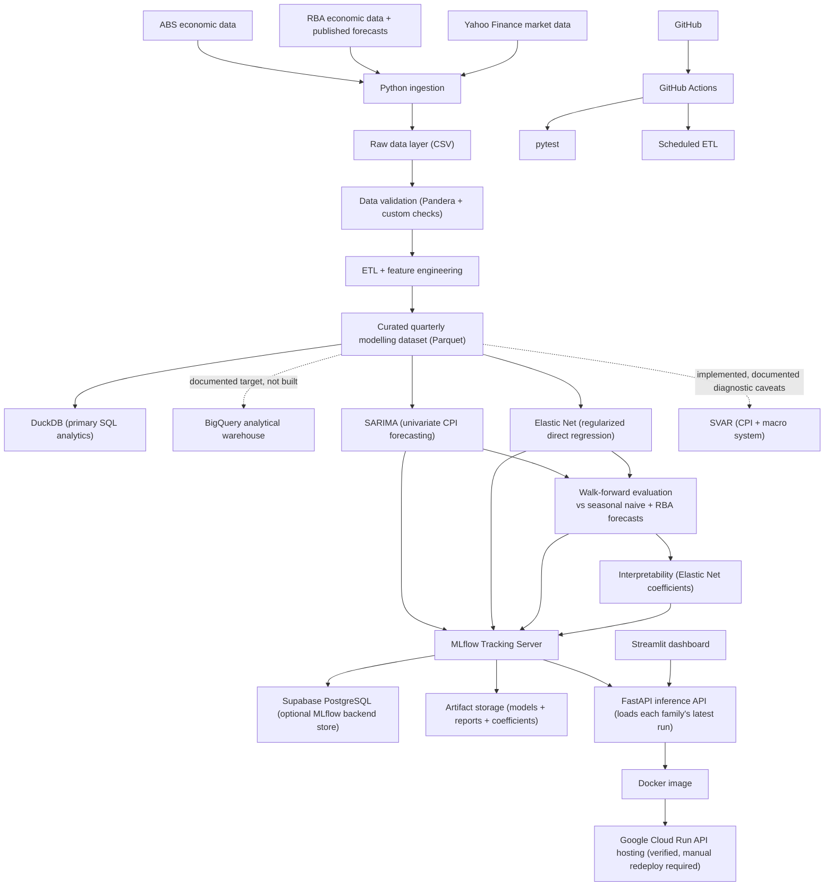

# CPI Forecast

An Australian inflation forecasting project, originally a university
time-series assignment, now being extended into an end-to-end data science
portfolio project. The modelling target throughout is `cpi_yoy` -- year-ended
(4-quarter) percentage change in the CPI index, i.e. headline inflation on
the same basis the ABS and RBA report it -- not the raw CPI index level. The
original notebook, `notebooks/cpi_forecast_V1.ipynb`, builds and evaluates a
quarterly SARIMA model using historical CPI observations from 1995 Q1 to
2022 Q4.

This document is the single source of truth for the project's story, status,
architecture decisions, and setup instructions (it replaces the previous
split between `README.md` and `PROJECT_ARCHITECTURE.md`).

## Core Question

> Can Australian inflation (year-ended CPI growth) forecasts be improved by
> combining historical CPI values with external macroeconomic indicators such
> as unemployment, wages, producer prices, interest rates, exchange rates,
> inflation expectations, commodity prices, and oil prices -- and how do those
> forecasts compare to the RBA's own published inflation projections?

The portfolio version compares **forecasting models** against **two
benchmarks**, plus a separate structural model for causal/scenario analysis
rather than forecast-accuracy competition. Neither benchmark counts as one of
the primary forecasting models.

| Role | Model | Type | Main inputs |
|---|---|---|---|
| Benchmark | Seasonal naive | statistical reference | CPI history |
| Benchmark | RBA published inflation forecast | institutional forecast | RBA's own projections |
| Primary 1 | SARIMA | univariate statistical | CPI history |
| Primary 2 | Elastic Net | regularized multivariate linear | CPI autoregressive lags + a lag-safe macro block |
| Combiner | Ensemble | SARIMA + Elastic Net combination | horizon-weighted blend of both point forecasts and simulated paths |
| Structural (implemented, documented caveats) | SVAR | structural vector autoregression | CPI + a small macro system, for impulse-response/scenario analysis |

A multivariate statistical model (SARIMAX, extending SARIMA with a fixed
macro feature block) was implemented, evaluated, and later **removed**: a
full assumption audit found its fitted coefficients were not reliably
significant and its AR root sat inside the unit circle even after a
dedicated re-selection attempt, which validated worse out-of-sample RMSE
than the original despite passing every classical diagnostic. See
`reports/model_interval_calibration_remediation_decisions.md` for the
evidence. The project now prioritises inference validity over adding a
second unregularized multivariate statistical model, and SVAR is now
implemented as the replacement for scenario/sensitivity analysis specifically because its
identification restrictions give a more defensible causal reading than a
plain regression coefficient does.

**Why two benchmarks:** beating seasonal naive is a low bar for an inflation
model -- almost any reasonable model clears it. The RBA publishes its own
inflation forecasts, so comparing SARIMA/Elastic Net/Ensemble against
those tests whether the project's models are competitive with a real
professional forecaster who has access to policy intentions, business
liaison data, and analyst judgment the statistical models don't see. The
project reports honestly if that bar isn't cleared.

The project is organised around three "flagship" deliverables, one per data
role, so each pillar is demonstrated deeply rather than every pillar being
demonstrated shallowly:

| Pillar | Flagship deliverable | Supporting evidence |
|---|---|---|
| Data Science | SARIMA vs Elastic Net vs Ensemble, walk-forward validated against seasonal naive **and** the RBA forecast, with Elastic Net coefficient interpretability | EDA notebook, feature engineering |
| Data Engineering | Ingestion -> validation -> curated Parquet -> DuckDB, fully local and credential-free | BigQuery documented as target, not deployed |
| ML Engineering | MLflow runs, FastAPI serving every trained model family plus scenarios (no promoted champion), Docker, and a verified Cloud Run deployment that still needs manual redeploy after future serving changes | Postgres as the optional MLflow backend and run metadata store |

## What `cpi_forecast_V1.ipynb` Found

The notebook follows a complete forecasting workflow: load and clean
`CPI_train.csv`, build a quarterly time-series index, run EDA (time-series
plots, boxplots, seasonal decomposition), test stationarity with ACF/PACF/ADF,
apply first-order and seasonal (lag 4) differencing, search for a SARIMA
specification with `pmdarima.auto_arima`, validate against a seasonal naive
benchmark using rolling-window validation, and produce out-of-sample forecasts
with confidence intervals. The selected model is:

```text
SARIMA(0, 1, 1)(0, 1, 1)[4]
```

This fits the series well because CPI has a clear upward trend (removed by
first differencing) and a repeating quarterly seasonal pattern (removed by
seasonal differencing at lag 4). SARIMA slightly improved on the seasonal
naive benchmark during rolling validation: on the 8-quarter test period it
achieved a test MSE of about `46.25` and RMSE of about `6.8` CPI points.
Residual diagnostics show no strong remaining autocorrelation, approximately
normal residuals, and no obvious remaining trend.

**Note on benchmarking:** these notebook results are only compared against
seasonal naive, since `cpi_forecast_V1.ipynb` predates the platform's
walk-forward evaluation harness. The project-wide SARIMA/Elastic Net
comparison against seasonal naive **and** the RBA forecast is now
implemented (see [Models In Detail](#models-in-detail) and
`reports/model_comparison_sarima.csv`,
`reports/model_comparison_elastic_net.csv`).

## Models In Detail

### Materiality

SARIMA, Elastic Net, and the Ensemble are optimized and evaluated for
forecast accuracy. Their walk-forward comparisons ask whether CPI history and
lag-safe macro predictors improve headline and trimmed-mean CPI forecasts
against simple and institutional benchmarks.

SVAR is a different exercise. It is implemented for structural
impulse-response and scenario analysis, not as an accuracy competitor to
SARIMA, Elastic Net, or the Ensemble. Both SVAR systems are documented
VAR(2)-in-levels specifications with recursive Cholesky identification and
block-bootstrap IRF bands, but both still reject multivariate residual
whiteness and multivariate normality after COVID exclusion/dummy checks and
the block-bootstrap fix. Scenario outputs should therefore be read as
illustrative structural sensitivities under an imperfect specification, not
as validated causal estimates.

The RBA classifier is separate again: it is a policy-action classification
exercise using leakage-safe Ensemble horizon-1 headline and trimmed-mean CPI
forecasts, not a CPI forecaster. Its transparent threshold baseline has the
best macro-F1 point estimate (`0.775`), just ahead of a deterministic
majority-vote ensemble (`0.769`) over threshold, estimated Taylor rule,
ordered logit, and ordered probit. The paired-bootstrap 95% interval for
threshold minus majority_vote_ensemble (`[-0.129, 0.131]`) crosses zero, so
the threshold lead is not statistically settled.

### SARIMA (implemented, baseline)

The existing SARIMA model remains the univariate statistical baseline,
providing a clean reference for measuring the value external predictors add.

### Elastic Net (implemented)

A regularized direct multi-horizon Elastic Net is the project's multivariate
model. Its coefficients are L1/L2-penalized and selected via `GridSearchCV`,
which keeps them stable and well-behaved on a small sample. It is a
forecast-accuracy model, not the structural scenario engine; the built SVAR
and scenario engine now fill that role. Elastic Net uses a lag-safe macro
feature block, plus explicit `cpi_yoy` autoregressive lags (a linear model has
no built-in AR structure the way SARIMA does), fitting one
`StandardScaler -> ElasticNet` pipeline per horizon (1-8) with `alpha`/
`l1_ratio` selected by `GridSearchCV` over chronological `TimeSeriesSplit`
folds -- so the scaler is refit on each fold's training rows only, never once
on the whole training window before cross-validation begins. On the shared
8-horizon grid it edges out plain SARIMA, though not the RBA benchmark --
evidence that regularizing the macro block helps on this sample size without
adding unnecessary architecture complexity.

**Interpretability:** per-horizon coefficients, intercept, and selected
`alpha`/`l1_ratio` are reported in `reports/elastic_net_coefficients.csv`.
Regularized coefficients are a conservative (shrunk-toward-zero) estimate of
sensitivity, not a causal effect -- see the SVAR note above for the more
rigorous version of that claim.

### SVAR (implemented locally, documented specification caveats)

The structural model is implemented as two five-variable systems using level
columns from the curated quarterly dataset:

- System A: `cpi_yoy`, `unemployment_rate`, `cash_rate`,
  `commodity_growth`, and `inflation_expectations_business`.
- System B: `trimmed_mean_cpi_yoy`, `unemployment_rate`, `cash_rate`,
  `commodity_growth`, and `inflation_expectations_business`.

Both systems use VAR lag order `p=2`, selected under the Phase 1a degrees-of-
freedom cap. The Johansen trace tests returned full rank (`rank=5`) for both
systems; under the corrected rank mapping, full rank maps to a levels VAR/SVAR
rather than a VECM because it indicates the system is stationary in levels
rather than partially cointegrated. That is a documented judgment call, not a
resolved stationarity finding: ADF pretests still fail to reject unit roots
for some series, and the Johansen full-rank result may be over-rejection in a
short 123-observation, `det_order=0` specification.

The fixed recursive Cholesky ordering places `commodity_growth` first,
`unemployment_rate` second, the CPI target third, business inflation
expectations fourth, and `cash_rate` last. This treats commodity shocks as the
most externally driven same-quarter shock and allows the policy reaction to
contemporaneously observe the macro block while policy shocks affect that
block with a lag.

Both systems receive full Phase 1b treatment. System B was primary by design;
System A escalated from confirmatory IRFs-only because 80% block-bootstrap IRF
bands did not overlap System B on the fixed shared-shock escalation check.
The shipped IRF uncertainty uses 80% contiguous residual block-bootstrap bands
for horizons 1-8. The diagnostic failures remain material: both full-sample
systems reject multivariate whiteness and multivariate normality, and those
core failures persist after excluding or dummying `2020Q2`/`2020Q3`. SVAR
backtest RMSE is diagnostic only and is not directly comparable to the
SARIMA, Elastic Net, or Ensemble comparison grids.

### Scenario Engine (implemented locally)

`POST /forecast/scenario` exposes SVAR-adjusted CPI scenarios for the
headline and trimmed-mean targets. The engine starts from existing SARIMA +
Elastic Net Ensemble predictive draws, fits the relevant Phase 1b SVAR
system, and computes the user's shock as the surprise relative to the SVAR's
horizon-1 macro forecast. Because the shock is realized at `t+1`, CPI horizon
1 receives the contemporaneous IRF impact at index 0; horizon `h` receives
IRF index `h - 1`.

The scenario combination is additive and paired draw-by-draw: Ensemble draw
`i` is combined with SVAR IRF draw `i`, multiplying the requested shock size
by the CPI response to that shock and adding the contribution to the baseline
forecast path. This avoids double-counting the expected macro path because
the adjustment uses only the surprise over the SVAR's own horizon-1 forecast,
not the full user-supplied macro value.

The API returns the scenario caveat from `src/models/scenario.py` with each
response: "Scenario IRFs come from Phase 1b VAR(2)-in-levels SVAR systems that
still fail multivariate residual whiteness and normality diagnostics after
COVID treatment checks and the block-bootstrap IRF fix; adjusted forecasts are
illustrative under a documented, imperfect specification, not precise causal
estimates."

### RBA Classifier (implemented locally, documented classifier comparison)

The RBA policy-action classifier is a Phase 3 classification exercise, not a
CPI forecasting model. It joins the leakage-safe Ensemble horizon-1 headline
and trimmed-mean CPI forecasts to actual cash-rate actions (`cut`, `hold`,
`hike`) over 53 usable quarters from `2011Q1` to `2024Q1`.

The selected expanding-window split uses `initial_train_size=12`, the first
audited candidate at or above the 12-row fit-size floor with no missing
policy classes or Frank-Hall binary outcomes in any training fold. On the
shared 41-quarter test set, the threshold rule leads on macro-F1 (`0.775`)
and accuracy (`0.756`), narrowly ahead of `majority_vote_ensemble`
(`0.769`, accuracy `0.732`), the walk-forward estimated Taylor rule
(`0.769`), ordered logit (`0.715`), ordered probit (`0.696`), the fixed
Taylor-rule baseline (`0.365`), and Frank-Hall XGBoost (`0.274`). The
majority-vote ensemble is not fitted: it combines the already-computed
threshold, estimated Taylor-rule, ordered-logit, and ordered-probit
predictions, excludes the weaker fixed Taylor rule and Frank-Hall XGBoost,
and uses threshold as the pre-set tie-breaker. The tie-break fired in 4 of
41 test quarters.

The macro-F1 gaps against the estimated Taylor rule, ordered models, and
majority-vote ensemble are not statistically settled: paired-bootstrap 95%
confidence intervals are `[-0.152, 0.168]` for threshold minus estimated
Taylor rule, `[-0.091, 0.223]` for threshold minus ordered logit,
`[-0.079, 0.251]` for threshold minus ordered probit, and `[-0.129, 0.131]`
for threshold minus majority_vote_ensemble. Threshold's gaps over fixed
Taylor rule and Frank-Hall XGBoost are strictly positive, with intervals
`[0.283, 0.538]` and `[0.342, 0.640]`, respectively.

The reportable result is therefore the transparent threshold baseline,
chosen despite unsettled challenger gaps because it has zero fitted
parameters and correctly classifies all 8 of 8 hike quarters in the test
set. The majority-vote ensemble is the best-performing non-threshold
alternative on the unrounded macro-F1 point estimate, fractionally ahead of
the estimated Taylor rule, but it does not beat threshold. These classifiers
are retained as documented comparison results; `GET /rba-action` is
implemented locally in `api/main.py` and serves `threshold`, `taylor_rule`,
`taylor_rule_estimated`, `ordered_logit`, `ordered_probit`,
`frank_hall_xgboost`, and `majority_vote_ensemble`, with `threshold` marked
as the reportable model. The fitted alternatives are not statistically shown
to beat threshold because the paired-bootstrap CIs cross zero in
`reports/rba_classifier_evaluation.md`.

A useful research framing:

> How does forecasting performance change as the project moves from
> univariate statistical modelling (SARIMA) to regularized direct
> multi-horizon regression (Elastic Net) -- and does any of that added
> structure close the gap to the RBA's own forecast accuracy?

## Architecture Decisions

This project deliberately does **not** wire up every platform a data role
might touch. Each tool has a specific, defensible job; anything without a
clear job is documented as a target rather than built.

| Decision | Reasoning |
|---|---|
| DuckDB is the built SQL/analytics layer; BigQuery is a documented target, not deployed | The curated dataset is ~125 quarterly rows read from a local Parquet file. A managed cloud warehouse adds real value at higher data volume or concurrency, neither of which applies yet. |
| Supabase PostgreSQL holds MLflow backend and application run metadata, not a second copy of the curated dataset | Two databases holding the same data demonstrates nothing new. Postgres gets a distinct job: storing experiment/run metadata queryable from the dashboard, while artifacts stay in MLflow artifact storage. |
| MLflow + FastAPI + Docker + Google Cloud Run is the flagship deployment path | This combination produces something clickable, not just partially-configured infrastructure -- a tracked serving stack and verified public Cloud Run URL (see Implementation Status). Cloud Run's usage-based free tier (scale-to-zero, configurable container memory) gives more headroom for statsmodels/sklearn dependencies than a fixed 512MB always-on free tier does. |
| Kubernetes, Terraform, Spark, Kafka, Airflow are excluded | None solve a problem this project actually has: one small model, a handful of requests, no elastic-scaling requirement. |
| A second benchmark (RBA's own published forecast) was added alongside seasonal naive | Beating seasonal naive is a low bar for an inflation model. Comparing against a real institutional forecaster is the bar that actually matters, and the project reports honestly if it isn't cleared. |

## Technology Stack

| Layer | Tools | Skill demonstrated |
|---|---|---|
| Language | Python | data science programming, modular design |
| Data retrieval | `readabs`, `yfinance`, `pandas` | API/library-based ingestion |
| Data storage | CSV, Parquet | reproducible local data layers |
| Validation | custom checks, Pandera | defensive data engineering |
| Local analytics (flagship) | DuckDB | SQL over local analytical files |
| Cloud warehouse | BigQuery -- documented target, optional load hook | warehouse design judgment |
| Relational store | Supabase PostgreSQL -- run/metrics metadata | scoped relational modelling |
| Forecasting | statsmodels, pmdarima, scikit-learn | SARIMA and Elastic Net |
| Interpretability | statsmodels and Elastic Net coefficient summaries | model explainability |
| Experiment tracking (flagship) | MLflow | MLOps and reproducibility |
| API (flagship) | FastAPI, Pydantic | backend model serving |
| Dashboard | Streamlit | interactive data product development |
| Testing | pytest | regression testing |
| Automation | GitHub Actions | CI/CD and scheduled jobs |
| Deployment (flagship) | Docker, Google Cloud Run | containerisation and cloud deployment |

## Implementation Status

| Platform | Status | Flagship? | Evidence |
|---|---|---|---|
| Data retrieval (ABS/RBA/market + RBA forecast history) | implemented | | `data_retrieval.py`, `dataset/` |
| ETL | implemented | | `src/build_curated_dataset.py` |
| Data validation (custom + Pandera) | implemented | | `src/validation.py`, `src/platform_validation.py` |
| Parquet | implemented | | `data/curated/quarterly_macro_features.parquet` |
| DuckDB/SQL analytics | implemented | **DE flagship** | `data/analytics/cpi_forecast.duckdb`, `src/platform_loads.py`, `sql/queries/` |
| EDA | implemented, 14 sections | | `notebooks/EDA.ipynb` |
| BigQuery | documented target only, optional load hook, not deployed | | `src/platform_loads.py`, `.env.example` |
| Supabase PostgreSQL | schema scaffolded, scoped to MLflow backend + run metadata | supporting for MLE flagship | `sql/schema_app_metadata.sql`, `.env.example` |
| SARIMA | implemented | **DS flagship** | `notebooks/cpi_forecast_V1.ipynb`, `src/models/sarima.py` |
| Elastic Net comparison + RBA benchmark | implemented | **DS flagship** | `src/models/`, `reports/model_comparison_elastic_net.csv`, `reports/elastic_net_coefficients.csv` |
| SVAR (structural, impulse-response) | implemented locally, documented specification caveats | | `src/models/svar.py`, `reports/svar_gate_decisions.md`, `reports/svar_five_variable_evidence_note.md` |
| Scenario engine (`POST /forecast/scenario`) | implemented locally, illustrative under documented SVAR caveats | | `src/models/scenario.py`, `api/main.py` |
| RBA policy-action classifier | implemented locally; `GET /rba-action` in `api/main.py` serves `threshold`, `taylor_rule`, `taylor_rule_estimated`, `ordered_logit`, `ordered_probit`, `frank_hall_xgboost`, and `majority_vote_ensemble`, with `threshold` marked reportable; fitted alternatives are not statistically shown to beat threshold | | `src/models/rba_classifier.py`, `api/main.py`, `reports/rba_classifier_evaluation.md` |
| Credit-risk stress test and illustrative AASB 9 12-month ECL (`GET /credit-risk/stress-test`) | implemented locally in `api/main.py`, composing `svar.forecast_cumulative_unemployment_change_quantiles` with `credit_stress.run_credit_stress_test` (`src/models/credit_stress.py`, `src/models/svar.py`); `PD_base` values in `data/metadata/pd_base_assumptions.csv` were replaced on 2026-09-05 with NAB's own disclosed FY2025 Pillar 3 weighted-average PDs (Table CR6, as at 30 Sep 2025) -- 2.07% for mortgages (residential mortgage exposure class) and 8.78% for personal loans (using the 'other retail' exposure class as its closest disclosed proxy, a mapping that is not exact); unemployment-sensitivity coefficients (0.4 for personal loans, 0.6 for mortgages) remain generic, published values from Garvin, Kurian, Major and Norman (2022), "Macrofinancial Stress Testing on Australian Banks", RBA Research Discussion Paper No 2022-03 -- applied uniformly across the nine banks that paper covers (including NAB by name in the paper, not derived or adapted for NAB specifically); on 2026-09-06 an illustrative 12-month, Stage-1-only AASB 9 ECL was added on top of this: `data/metadata/lgd_ead_assumptions.csv` adds NAB's own disclosed FY2025 Pillar 3 LGD and EaD post-CCF-and-post-CRM figures from the same Table CR6 disclosure (16% LGD / $429,996m EAD for residential mortgage, 73% LGD / $1,663m EAD for other retail), three downside/base/upside unemployment scenarios reuse the existing `svar.simulate_paths_from_fit` block-bootstrap machinery (no new model) instead of one point stress, and the three are combined into a probability-weighted `ecl_aud_m_12m_probability_weighted = pd_stressed * lgd * ead` per segment using NAB's own disclosed FY2025 Annual Report macroeconomic scenario weightings (55% base, 42.5% downside, 2.5% upside); this ECL explicitly has no SICR/staging (so no lifetime ECL for Stage 2/3, which a real provision would add), and holds LGD/EAD fixed across scenarios (only PD is stressed); on 2026-09-09, discounting was added -- `data/metadata/discount_rate_assumptions.csv` adds a per-segment effective-interest-rate proxy from RBA's published lending-rate tables (6.80% mortgages from Statistical Table F5, series FILRHLBVD, as at 31 Aug 2026; 8.86% personal_loans from Statistical Table F8, series FLRPFOFTT, as at 31 Jul 2026, used because Table F5's personal term-loan series was discontinued from April 2020), and `ecl_aud_m = pd_stressed * lgd * ead / (1 + discount_rate) ** 0.5` applies a mid-year discount -- the `^0.5` convention is a general DCF valuation technique (Aswath Damodaran, NYU Stern; McKinsey & Company's Valuation reference) applied here by analogy, not an AASB 9- or ECL-specific prescription; verified against NAB's FY2025 Annual Report (Note 17, Provision for credit impairment) that this figure is not a lower bound on NAB's real provision and is not comparable to it at all, since `pd_base` is NAB's disclosed average PD blended across whatever mix of Stage 1/2/3 exposures sits in that exposure class, applied here to the full EAD rather than a Stage-1-only subset -- NAB's real Stage 1 provision was only $646m of a $6,165m Group total (~10.5%), and NAB's real total (all three stages) Housing provision was $1,296m, both smaller than this project's illustrative Stage-1-only, probability-weighted `mortgages` ECL of ~$1.59bn (post-discounting); a Stage 2/3 addition or "staging discount" were considered and rejected, since NAB only discloses stage splits at the whole-Group level with no Housing- or retail-specific breakdown to apply; combining these real disclosed inputs with this generic, simplified mechanism is still not NAB's own stress-testing or ECL methodology and must not be used for actual credit, regulatory, or accounting-provision decisions; `data/curated/credit_quality_quarterly.csv` (APRA aggregate non-performing/impaired-loan ratio, from this feature's earlier design before the pivot to the cited RBA coefficients) is retained as corroborating context only and does not calibrate any of these base values, sensitivity coefficients, or scenario weights; implemented locally only, not part of the verified 2026-08-29 Cloud Run deployment; no Streamlit page and no Tableau workbook exist yet for this endpoint, both explicitly out of scope for this phase | | `src/models/credit_stress.py`, `src/models/svar.py`, `api/main.py`, `data/metadata/pd_base_assumptions.csv`, `data/metadata/lgd_ead_assumptions.csv`, `data/metadata/discount_rate_assumptions.csv`, `data/curated/credit_quality_quarterly.csv` |
| MLflow | implemented locally: comparison runs log params, metrics, report artifacts, and full-sample model artifacts | **MLE flagship** | `src/models/tracking.py`, `mlruns/` (local, gitignored) |
| FastAPI | implemented locally: `/health`, `/features`, `/forecast/all`, `/forecast/trimmed-mean/all`, `/forecast/scenario`, `/rba-action`, and `/credit-risk/stress-test`; the current local API serves every trained forecast family directly from latest MLflow runs, with no promoted champion or Model Registry alias | **MLE flagship** | `api/main.py`, `src/models/registry.py`, live deployment caveat below |
| Docker / Google Cloud Run | deployed and live: https://cpi-forecast-api-887232555982.asia-southeast1.run.app/docs -- verified 2026-08-29 on image tag `redeploy-20260829-d3102c9`, serving `/forecast/all`, `/forecast/trimmed-mean/all`, and `/forecast/scenario` from baked local MLflow runs. `GET /rba-action` and `GET /credit-risk/stress-test` are implemented locally after that verified image and are not claimed deployed. Future serving or model-artifact changes still require manual image rebuild, push, and redeploy | **MLE flagship** | `Dockerfile`, `.dockerignore` |
| Streamlit | implemented locally: Overview, Data Explorer, EDA Dashboard, Forecasts with headline/trimmed-mean toggle, Scenario Explorer, RBA Policy, Methodology, and Diagnostics; pages call FastAPI live or read local reports rather than fitting models in-process | supporting | `app/streamlit_app.py`, `app/pages/` |
| GitHub Actions | CI + scheduled ETL scaffolded; no deploy-to-Cloud-Run step, so the live service above does not auto-update on push | supporting | `.github/workflows/` |

FastAPI is implemented locally and deployed on Google Cloud Run (see the row
above); redeploying after code changes is currently a manual step, not
automated.
Supabase and BigQuery still require account setup, credentials, and
deployment configuration and remain undeployed (see Architecture Decisions
above). Nothing else in the repository should be described as deployed until
its own public URL and credentials are configured and verified the same way.

## Data Retrieval

`data_retrieval.py` is a reproducible pipeline for downloading Australian
macroeconomic and market indicators, separate from the original modelling
notebook. It downloads from ABS (`readabs`), RBA (`readabs`), and market data
(`yfinance`), saving under `dataset/{abs,rba,market}/` plus a
`download_manifest.json` recording download time, package versions, year
range, output files, row counts, and column names.

Retrieved series:

- CPI index, unemployment rate, wage price index, producer price index, household spending (ABS)
- RBA cash rate, AUD/USD exchange rate, inflation expectations, commodity price indexes (RBA)
- WTI and Brent crude oil futures (market)

**RBA historical CPI forecasts by horizon (newly implemented):**
`data_retrieval.py` now downloads the RBA's published `cpi-by-horizon.xls`
workbook, tidies its Forecasts/Actuals/Errors sheets into one table keyed by
`forecast_date`, `horizon_label`, and `horizon_quarters`, and saves it to
`dataset/rba/rba_historical_cpi_forecasts_by_horizon_<start>_<end>.csv` with
columns `rba_forecast_cpi_yoy`, `rba_actual_cpi_yoy`, and
`rba_forecast_error_cpi_yoy`. This is the reproducible source for the second
benchmark described in [Core Question](#core-question) -- it replaces what
was previously a "planned addition" pasted-in manually.

```bash
python -m pip install -r requirements-data.txt
python data_retrieval.py 1995 2025 --output-dir dataset
```

## ETL And Feature Engineering

`src/build_curated_dataset.py` validates the raw ABS/RBA/market CSVs,
converts monthly/quarterly/daily series to quarterly frequency, builds CPI
inflation/growth-rate/lagged predictor features (`src/features.py`), merges
everything into one modelling table, validates the curated output (custom
checks + Pandera when installed), attempts a DuckDB analytical load, and
writes a data-quality report.

**Rate-change features:** `src/features.py` adds `cash_rate_change` and
`unemployment_rate_change` (percentage-point differences, via
`add_growth_rates`) alongside their lagged versions (`cash_rate_change_lag1`,
`unemployment_rate_change_lag1/lag2`) and `household_spending_growth_lag1`,
covered by `tests/test_features.py`. The curated dataset has been regenerated
and these features are already consumed by Elastic Net
(see [Models In Detail](#models-in-detail)).

```bash
python -m src.build_curated_dataset
```

Outputs:

```text
data/processed/
data/curated/quarterly_macro_features.csv
data/curated/quarterly_macro_features.parquet
data/analytics/cpi_forecast.duckdb
reports/data_quality_report.csv
```

The Parquet output requires `pyarrow`; Pandera and DuckDB are optional local
platform dependencies -- if one is missing, the pipeline records a warning and
continues with CSV output and custom validation. Optional, stretch-goal cloud
loads (documented target architecture, not required for the MVP):

```bash
python -m src.build_curated_dataset --load-bigquery
python -m src.build_curated_dataset --load-postgres
```

`--load-postgres` writes run/metrics metadata, not a duplicate of the curated
dataset. Both require the relevant environment variables in `.env.example`.

### Data Validation

`src/validation.py` runs custom checks (required columns exist, dates
parseable/unique/sorted, numeric columns are numeric, no unexpected empty
datasets, CPI target not missing, one row per quarter, lagged features don't
reorder rows). `src/platform_validation.py` adds Pandera schema validation for
the curated table. Results are written to `reports/data_quality_report.csv`.

## Exploratory Data Analysis

`notebooks/EDA.ipynb` is a leakage-aware EDA pass over
`data/curated/quarterly_macro_features.csv`/`.parquet`, needed because the
ETL aligns originally monthly, quarterly, and daily series into one quarterly
table, and the resulting predictors need a stationarity, lead-lag, and
forecast-origin-availability screen before they can be trusted in a
multivariate model. The notebook now has **14 sections**, all implemented:

1. Data integrity checks (duplicate timestamps, monotonic index, expected frequency)
2. Missing values and usable-history coverage per variable
3. CPI target inspection (index, QoQ, YoY, trend/seasonality/volatility/structural breaks)
4. **CPI seasonal decomposition and ACF/PACF diagnostics** (newly implemented) -- STL trend/seasonal/residual split plus ACF/PACF on CPI YoY and differenced CPI, to inform SARIMA order selection
5. External variable inspection (scale, distribution, outliers, economic interpretation)
6. Stationarity tests (ADF + KPSS, guiding levels/differences/log-changes per variable)
7. Lead-lag correlation analysis (cross-correlation at 1/2/4-quarter lags)
8. Granger causality screening (predictive-value screen, not structural causality)
9. Multicollinearity and VIF
10. Leakage and forecast-origin availability assumptions (backed by `data/metadata/series_availability.csv`)
11. Candidate exogenous feature screening for multivariate modelling (screening-stage shortlist, not final selection)
12. **Rolling correlations / relationship stability** (newly implemented) -- checks whether CPI-predictor relationships are stable through time or only strong during unusual periods
13. **Raw source frequency validation spot check** (newly implemented) -- reconciles two representative raw inputs against the curated quarterly values using the ETL's own `to_quarterly()` rule, as a light audit rather than a full raw-source review
14. **RBA forecast error benchmark preparation** (newly implemented) -- summarises the newly retrieved RBA historical CPI forecast errors by horizon, as benchmark preparation for the modelling stage

**Remaining follow-ups documented in the notebook:**

- The rolling-origin SARIMA/Elastic-Net-vs-RBA comparison the
  notebook's RBA forecast-error summary was preparing for is now implemented
  (see [Models In Detail](#models-in-detail)).
- `data/metadata/series_availability.csv` is an assumption-backed
  forecast-origin lag table, not official release-calendar metadata, since
  the project currently uses revised historical data rather than real-time
  vintages.

## Advanced Forecasting Ideas From Recent Literature

Peng et al. (2025) propose MSP-EDA, a multivariate forecasting framework
combining multiscale patch representations (Fourier for global periodicity,
wavelets for local time-frequency variation) with attention-based external
data augmentation. The full architecture is likely too complex for this
project's small quarterly sample, but several ideas remain useful and map onto
work already underway or planned:

- **Multiscale CPI analysis** -- quarterly, YoY, rolling 2/4-year averages (partly covered by EDA sections 3-4).
- **Frequency-domain diagnostics** -- Fourier/periodogram confirmation of quarterly seasonality (partly covered by the new STL/ACF-PACF section).
- **External-data quality score** -- score each predictor on coverage, missingness, frequency alignment, publication delay, and economic relevance before modelling.
- **Horizon-level evaluation** -- report accuracy by forecast horizon (1Q..8Q), not only overall RMSE.
- **Ablation studies by variable group** -- labour market, price-pressure, monetary/exchange-rate, commodity/oil, combined.
- **Cross-variable relationship diagnostics** -- lag correlations, Granger tests, VIF, and coefficient interpretation as an interpretable stand-in for attention-based relationship learning.

## High-Level Architecture

The flow is MLflow-centred: model training and walk-forward evaluation
produce tracked runs and artifacts; the API loads each family's latest
finished run directly and serves every family side by side, keeping the API
focused on inference rather than training logic. There is no promoted
"champion" model or MLflow Model Registry step in this project.



## API, Dashboard, And Deployment

**Streamlit** is the interactive UI, and **FastAPI** the model-serving
backend behind it -- both are part of the plan together, not an either/or
choice. Streamlit fits exploration, EDA, and model comparison since this is
primarily a data science project; FastAPI fits serving the selected model as
a reusable endpoint. Streamlit calls FastAPI rather than fitting models
directly in the UI, keeping model logic in one place.

Implemented FastAPI endpoints (`api/main.py`):

```text
GET  /health
GET  /metrics
GET  /features
GET  /models
POST /forecast
POST /forecast/all
```

`POST /forecast/all` includes empirical interval-coverage diagnostics from
`reports/model_interval_calibration_validation.csv` only for the validated
10th-90th percentile interval. The served default intervals apply the static
calibration factors in `reports/model_interval_calibration_factors.csv` when
available; the coverage diagnostics describe held-out validation performance
for the calibrated intervals currently returned by the API. On the current
held-out validation slice, elastic_net, ensemble, and sarima all remain below
nominal 80% coverage after calibration -- see
`reports/model_interval_calibration_remediation_decisions.md` for what has
been tried and why coverage remains under nominal.

Implemented Streamlit pages: Overview, Data Explorer, EDA Dashboard, Forecasts
with headline/trimmed-mean toggle, Scenario Explorer, RBA Policy, Methodology,
and Diagnostics. Diagnostics now covers RMSE/MAE-by-horizon, benchmark
comparisons, interval coverage, and forecast-vs-actual walk-forward backtests.
Residual diagnostics and permutation-importance/coefficient interpretability
are still not built in Streamlit.

Container deployment path: FastAPI -> Docker image -> Google Cloud Run. The
live URL was verified on 2026-08-29 with image tag
`redeploy-20260829-d3102c9`:
https://cpi-forecast-api-887232555982.asia-southeast1.run.app/docs. That
deployment serves `/forecast/all`, `/forecast/trimmed-mean/all`, and
`/forecast/scenario`; `GET /rba-action` is implemented locally in
`api/main.py` after that verified image and is not claimed deployed.
Every trained model family's MLflow runs currently live in the local
gitignored `mlruns/` file store, so the Docker image must be built from a
local checkout that already has finished runs for each family:

```bash
python -m src.models.evaluation
python -m src.models.elastic_net
python -m src.models.model_comparison

docker build -t cpi-forecast-api:latest .
docker run --rm -d --name cpi-forecast-api -p 8000:8000 cpi-forecast-api:latest
curl http://127.0.0.1:8000/health
curl -X POST http://127.0.0.1:8000/forecast/all \
  -H "Content-Type: application/json" \
  -d '{"horizon":4}'
docker stop cpi-forecast-api

gcloud auth configure-docker <region>-docker.pkg.dev
docker tag cpi-forecast-api:latest <region>-docker.pkg.dev/<project-id>/<repo>/cpi-forecast-api:latest
docker push <region>-docker.pkg.dev/<project-id>/<repo>/cpi-forecast-api:latest
```

Then deploy the pushed image directly (no git-triggered build):

```bash
gcloud run deploy cpi-forecast-api \
  --image <region>-docker.pkg.dev/<project-id>/<repo>/cpi-forecast-api:latest \
  --memory 2Gi \
  --allow-unauthenticated
```

Do not use a git-triggered build for this version: a fresh `git clone` will
not include `mlruns/` (it's gitignored), so every family's model artifacts
would be missing. Deploying the pre-built image intentionally bakes the
current local MLflow run history into the image; that is an accepted
tradeoff at this project's scale. The Dockerfile rewrites
absolute local `mlruns/` artifact paths to `/app/mlruns` during image build so
the baked MLflow file store resolves inside the container. Cloud Run injects a
`PORT` environment variable and expects the container to listen on it, which
the Dockerfile's `CMD` respects.

Streamlit -> Streamlit Community Cloud. DuckDB stays local; Supabase
PostgreSQL is optional and scoped to run/metrics metadata only. GitHub Actions
runs tests and the scheduled ETL.

## Repository Structure

```text
.
+-- notebooks/
|   +-- cpi_forecast_V1.ipynb       # Main university forecasting notebook
|   +-- EDA.ipynb                   # Leakage-aware EDA, 14 sections
|   +-- CPI_train.csv               # Original CPI training data
|   +-- CPI_forecast.csv            # Forecast output from the notebook
+-- dataset/                        # Downloaded ABS, RBA, and market datasets
+-- data/
|   +-- processed/                  # Quarterly individual series
|   +-- curated/                    # Final modelling dataset
|   +-- analytics/                  # DuckDB database
|   +-- metadata/                   # series_availability.csv
+-- reports/                        # Data quality and platform status reports
+-- src/                            # ETL, validation, feature, and status code
+-- tests/                          # Validation/transform/feature tests
+-- api/                            # FastAPI model-serving service
+-- app/                            # Streamlit dashboard
+-- sql/                            # SQL queries and metadata schema
+-- .github/workflows/              # CI and scheduled ETL workflows
+-- data_retrieval.py
+-- requirements-data.txt
+-- requirements.txt
+-- Dockerfile
+-- README.md
```

## Running The Project

```bash
# data retrieval (network access required)
python -m pip install -r requirements-data.txt
python data_retrieval.py 1995 2025 --output-dir dataset

# ETL + validation
python -m src.build_curated_dataset

# tests
python -m pytest tests

# platform status report
python -m src.platform_status

# API
uvicorn api.main:app --reload

# dashboard
streamlit run app/streamlit_app.py
```

## Roadmap

The Data Science flagship (item 1) and dashboard polish (item 4) are done; the
project now moves into the other two flagship pillars.

1. **Data Science flagship (done):** SARIMA and a regularized direct
   multi-horizon Elastic Net (per-horizon coefficients) are walk-forward
   validated against seasonal naive **and** the RBA benchmark, reported
   overall and by horizon -- `src/models/`, `reports/model_comparison_*.csv`.
   A multivariate SARIMAX model was implemented, evaluated, and removed
   after a full assumption audit found it did not survive out-of-sample
   validation despite passing every classical diagnostic -- see
   `reports/model_interval_calibration_remediation_decisions.md`. The SVAR
   and scenario engine are now implemented locally for structural
   impulse-response/scenario analysis, with the documented caveat that both
   SVAR systems still fail whiteness and normality diagnostics and are not
   forecast-accuracy competitors.
2. **ML Engineering flagship (API current; Cloud Run deployment verified
   2026-08-29):** every run (params, features, horizon, metrics,
   and model settings) logs to MLflow; local FastAPI (`/health`, `/features`,
   `/forecast/all`, `/forecast/trimmed-mean/all`, `/forecast/scenario`,
   `/rba-action`) serves
   every trained forecast family directly from its latest MLflow run, with no
   promoted champion or Model Registry step; containerised with Docker and
   deployed to Cloud Run on image tag `redeploy-20260829-d3102c9`, with manual
   redeploy still required after future serving or model-artifact changes.
3. **Data Engineering flagship:** confirm DuckDB SQL examples against the
   regenerated curated dataset; add the Postgres run/metrics metadata store;
   confirm GitHub Actions CI and scheduled ETL after pushing.
4. **Supporting polish (done):** Streamlit now includes Overview, Data
   Explorer, EDA Dashboard, Forecasts with headline/trimmed-mean toggle,
   Scenario Explorer, RBA Policy, Methodology, and Diagnostics; pages call
   FastAPI live or read local reports rather than fitting models in the UI.

The result should read as a coherent, intentionally-scoped platform: a
university SARIMA assignment extended into reproducible ingestion (including
a real forecaster's own predictions), leakage-aware ETL, a
SARIMA/Elastic Net comparison against both seasonal naive and the RBA,
real MLflow tracking,
FastAPI serving, a Streamlit dashboard, Docker/Cloud Run deployment, and CI --
with explicit, written reasoning for every tool included and excluded, rather
than a checklist of every tool in a data science job posting.

## Explicitly Excluded Technologies

Not added unless a clear reason emerges: Kubernetes, Apache Spark, Kafka,
Airflow, Terraform, Databricks, SageMaker, large transformer-based
forecasting architectures, real-time streaming, complex microservices, OAuth,
automated model-drift retraining, and a second full data warehouse alongside
DuckDB. The dataset is small, quarterly, and public -- the strongest
portfolio signal is sound modelling and clean engineering judgment, not
excessive infrastructure, and explicitly excluding tools (and saying why) is
itself evidence of that judgment.

## References

Peng, S., Sun, W., Chen, P., Xu, H., Ma, D., Chen, M., Wang, Y., & Li, H.
(2025). MSP-EDA: Multivariate time series forecasting based on multiscale
patches and external data augmentation. *Electronics, 14*(13), 2618.
https://doi.org/10.3390/electronics14132618

Garvin, N., Kurian, S., Major, M., & Norman, D. (2022). *Macrofinancial
Stress Testing on Australian Banks* (RBA Research Discussion Paper No.
RDP 2022-03). Reserve Bank of Australia.

National Australia Bank. (2025). *Pillar 3 Disclosure Report — 30 September
2025* (Table CR6, Credit Risk Exposures).

National Australia Bank. (2025). *Annual Report 2025* (Note 17, Provision
for Credit Impairment; macroeconomic scenario probability weightings).
