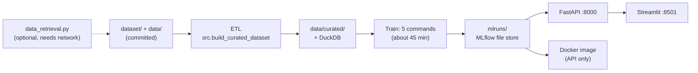

# CPI Forecast

Australian year-ended CPI inflation forecasting, taken from a university
time-series assignment to an end-to-end project: reproducible data retrieval
and ETL, SARIMA / Elastic Net / Ensemble models walk-forward validated
against seasonal naive and the RBA's own forecasts, a structural VAR with a
scenario engine, an RBA policy-action classifier, an illustrative credit-stress
test, and a FastAPI + Streamlit app with a Cloud Run deployment.

**Live links** (nothing to install):

| | |
|---|---|
| Interactive demo | https://cpi-forecast-demo.streamlit.app/ |
| Jupyter Book (results and methodology) | https://juanvu1810.github.io/CPI-Forecast/ |
| Forecast API docs | https://cpi-forecast-api-887232555982.asia-southeast1.run.app/docs |
| Source code | https://github.com/JuanVu1810/CPI-Forecast |

Start the book with *Key Findings*. The demo lets you run a live forecast, watch the
Ensemble's simulated paths, try your own shock in the scenario engine and see the RBA
call. This README only covers status and how to run the project.

## Status

| Component | Status |
|---|---|
| Data retrieval, ETL, validation (custom + Pandera), Parquet, DuckDB | implemented |
| SARIMA, Elastic Net, Ensemble for headline and trimmed-mean CPI, walk-forward validated | implemented |
| SVAR and scenario engine | implemented locally; illustrative, since both VAR systems fail residual whiteness and normality diagnostics |
| RBA policy-action classifier | implemented; served by the Cloud Run API since 2026-09-21 |
| Credit-risk stress test and illustrative 12-month ECL | implemented; illustrative only; served by the Cloud Run API since 2026-09-21 |
| MLflow tracking | implemented locally (file store in `mlruns/`, gitignored); no champion model or Model Registry |
| FastAPI | implemented, 7 endpoints; live on Cloud Run |
| Docker and Google Cloud Run | deployed, verified live 2026-09-21 (image `redeploy-20260921-e905627`, revision `cpi-forecast-api-00016-vig`). Serves the forecast, trimmed-mean, scenario, RBA and credit endpoints; redeploy is manual |
| Streamlit | deployed on Streamlit Community Cloud, verified live 2026-09-21: <https://cpi-forecast-demo.streamlit.app/>. A four-tab interactive demo that goes with the book (live forecast, Ensemble path reveal, scenario engine, RBA call) |
| Jupyter Book | deployed to GitHub Pages by GitHub Actions |
| GitHub Actions (tests, monthly scheduled ETL) | scaffolded; no Cloud Run deploy step |
| BigQuery | target architecture only; optional load hook, not deployed |
| Supabase PostgreSQL | schema scaffolded (`sql/schema_app_metadata.sql`); not deployed |

## Choose how to run it

| I want to | Use | Needs |
|---|---|---|
| Read the results | the book, or the live API docs | nothing |
| Run everything: ETL, tests, training, API, Streamlit, book | [Python](#run-with-python) | Python 3.11; about 45 minutes of model training |
| Serve just the API in a container | [Docker](#run-with-docker-api-only) | Docker, plus models trained with the Python path first |

**Docker alone is not enough on a fresh clone.** The trained models live in
`mlruns/`, which is gitignored, and the image build copies that folder. Train
once with the Python path, then build the image.



## Run with Python

### Prerequisites

- **Python 3.11** (what CI and the Dockerfile use). Older versions such as 3.8 cannot import `src/models`.
- **git**, and network access for `pip install` (and for the optional data download).
- **Windows:** use WSL2. The commands below are bash, and the Docker build's MLflow path rewriter only handles POSIX paths.

### 1. Get the code and install

```bash
git clone https://github.com/JuanVu1810/CPI-Forecast.git
cd CPI-Forecast
python3.11 -m venv .venv
source .venv/bin/activate
python -m pip install --upgrade pip
python -m pip install -r requirements.txt        # about 2 minutes
```

`requirements.txt` is unpinned. This README was last verified on 2026-09-20
with Python 3.11.15, pandas 3.0.6, numpy 2.4.6, statsmodels 0.15.0,
scikit-learn 1.9.1, xgboost 3.2.0, mlflow 3.16.1, fastapi 0.141.1 and
streamlit 1.64.0.

### 2. Data (optional: it is already in the repository)

The repository ships the downloaded source data (`dataset/`) and the curated
modelling dataset (`data/curated/`). To rebuild the curated dataset, which also
rebuilds the DuckDB database (about a second):

```bash
python -m src.build_curated_dataset
```

It writes `data/processed/`, `data/curated/quarterly_macro_features.csv` and
`.parquet` (128 quarters, 54 columns), `data/analytics/cpi_forecast.duckdb`, and
`reports/data_quality_report.csv`.

To query the DuckDB database:

```bash
python - <<'EOF'
import duckdb, pathlib
con = duckdb.connect("data/analytics/cpi_forecast.duckdb", read_only=True)
print(con.sql(pathlib.Path("sql/queries/annual_inflation_summary.sql").read_text()).df().head())
EOF
```

To re-download the source data from ABS, RBA, APRA and Yahoo Finance (network
needed, under a minute), then rebuild:

```bash
python data_retrieval.py 1995 "$(date +%Y)" --output-dir dataset
python -m src.build_curated_dataset
```

Downloads are named `<series>_<start>_<end>.csv` after the year range you pass.
The ETL uses the newest file for each series (largest end year), so a refresh
with a later end year is picked up without editing any paths.

The models and the EDA are pinned at the 2025Q4 forecast origin
(`svar.FORECAST_ORIGIN_PIN`), so newly downloaded quarters do not change their
results. The curated table keeps the 2026 quarters only so the pinned forecasts
can be benchmarked against them. The EDA (`notebooks/EDA.ipynb`, the book's
appendix and `python -m src.eda_export`, which writes
`reports/eda_*.csv`) never sees them.

### 3. Run the tests

```bash
python -m pytest tests                            # 175 tests, about 3 minutes
```

### 4. Train the models

The API serves each model family from its latest finished MLflow run, so the
runs must exist first. Run these five commands once, in this order:

| Command | Logs | Time* |
|---|---|---|
| `python -m src.models.evaluation` | headline SARIMA | 25 s |
| `python -m src.models.elastic_net` | headline Elastic Net | 9 min |
| `python -m src.models.ensemble` | headline Ensemble | 9 min |
| `python -m src.models.model_comparison --target trimmed_mean` | trimmed-mean SARIMA and Elastic Net | 17 min |
| `python -m src.models.ensemble --target trimmed_mean` | trimmed-mean Ensemble | 10 min |

\*Measured on one WSL2 machine; expect variation.

Runs go to `mlruns/` (MLflow experiment "CPI Forecast"). Training also rewrites
the CSVs in `reports/`. The results are deterministic, so they come out
identical to the committed files. Only the bytes of the Parquet file from step 2
can differ, depending on your `pyarrow` version.

### 5. Start the API

```bash
uvicorn api.main:app --port 8000
```

Interactive docs are at <http://localhost:8000/docs>. Check it:

```bash
curl http://localhost:8000/health
curl -X POST http://localhost:8000/forecast/all \
  -H "Content-Type: application/json" -d '{"horizon": 4}'
```

`/forecast/all` returns `models` (one entry each for `sarima`, `elastic_net` and
`ensemble`, with `forecast`, `interval_lower`, `interval_upper`, `quarters` and
`forecast_origin`) and `unavailable` (families with no trained run). A scenario
request shocks one SVAR variable to a level:

```bash
curl -X POST http://localhost:8000/forecast/scenario \
  -H "Content-Type: application/json" \
  -d '{"target": "headline", "shock_variable": "unemployment_rate", "shock_value": 6.0, "horizons": [1, 2, 3, 4]}'
```

`target` is `headline` or `trimmed_mean`; `shock_variable` is one of
`unemployment_rate`, `cash_rate`, `commodity_growth` or
`inflation_expectations_business`.

| Method | Path | Purpose |
|---|---|---|
| GET | `/health` | liveness and curated-dataset check |
| GET | `/features` | row count, columns and quarter range of the curated dataset |
| POST | `/forecast/all` | headline forecasts from every family; body: `horizon` (1 to 8, default 8), `n_sims`, `interval_lower`, `interval_upper` |
| POST | `/forecast/trimmed-mean/all` | the same for trimmed-mean CPI |
| POST | `/forecast/scenario` | SVAR shock scenario |
| GET | `/rba-action` | RBA cut/hold/hike readings from seven classifiers |
| GET | `/credit-risk/stress-test` | illustrative credit stress and 12-month ECL |

The Cloud Run deployment serves `/health` and the forecast, trimmed-mean,
scenario, RBA and credit endpoints (verified live 2026-09-21). On its single CPU,
`/forecast/scenario` takes about 40 to 46 seconds and `/rba-action` about 30 to
45. The simulation-based outputs of those two can differ from a local run in the
third decimal (for example an RBA cut probability of 0.8% instead of 0.6%); the
call is the same.

### 6. Start Streamlit

A hosted copy is live at <https://cpi-forecast-demo.streamlit.app/>; run it locally to change it or to use
your own API.

In a second terminal, with the same virtual environment active:

```bash
streamlit run app/streamlit_app.py               # http://localhost:8501
```

The app is a four-tab demo to go with the book: Live forecast, 4.3 Ensemble,
4.5 Scenario Engine and 4.6 RBA Policy Classifier. All but the Ensemble tab call
the API, so start the API first (a scenario takes about 40 seconds). The "API base URL" box defaults to
`http://localhost:8000`; set `API_BASE_URL` to change the default.

### 7. Build the book

Use a separate environment, as CI does:

```bash
python3.11 -m venv .venv-book
source .venv-book/bin/activate
python -m pip install -r book/requirements.txt
jupyter-book build book/australian_cpi_forecasting
```

Open `book/australian_cpi_forecasting/_build/html/index.html`. The build takes
seconds: chapter outputs are pre-executed (`execute_notebooks: off`), so it
never trains a model.

### Configuration

Everything has a working default; set these only to change it.

| Variable | Default | Effect |
|---|---|---|
| `MLFLOW_TRACKING_URI` | `mlruns` | where runs are logged and read |
| `MLFLOW_EXPERIMENT_NAME` | `CPI Forecast` | experiment the API reads from |
| `API_BASE_URL` | `http://localhost:8000` | API the Streamlit app calls |
| `CPI_DEMO_HOSTED` | unset | set to `1` on a public deployment: locks the API address to `API_BASE_URL` and swaps the local "start uvicorn" messages for visitor-friendly ones |
| `PORT` | `8000` | port the Docker image listens on |

`.env.example` also lists BigQuery and Supabase settings. A normal run does not
use them.

## Run with Docker (API only)

The image serves the FastAPI service only. It does not include Streamlit,
tests, notebooks or the book. Run [step 4](#4-train-the-models) first so
`mlruns/` exists; without it the build fails at the `COPY mlruns` step.

```bash
docker build -t cpi-forecast-api:latest .
docker run --rm -d --name cpi-forecast-api -p 8000:8000 cpi-forecast-api:latest
curl http://127.0.0.1:8000/health
curl -X POST http://127.0.0.1:8000/forecast/all \
  -H "Content-Type: application/json" -d '{"horizon": 4}'
docker stop cpi-forecast-api
```

The build rewrites the absolute host paths that MLflow stored in `mlruns/` so
they resolve to `/app/mlruns` inside the container.

`.dockerignore` keeps most of `reports/` out of the image and allows back only the
CSVs the API reads at request time. If an endpoint starts reading a new report or
data file, add it there (or copy its folder in the `Dockerfile`), or the deployed
image will return 503 for that endpoint while everything works locally.

### Deploy to Google Cloud Run

Push the pre-built image and deploy it directly. Do not use a git-triggered
build: `mlruns/` is gitignored, so a build from git would have no models.

```bash
gcloud auth configure-docker <region>-docker.pkg.dev
docker tag cpi-forecast-api:latest <region>-docker.pkg.dev/<project-id>/<repo>/cpi-forecast-api:latest
docker push <region>-docker.pkg.dev/<project-id>/<repo>/cpi-forecast-api:latest

gcloud run deploy cpi-forecast-api \
  --image <region>-docker.pkg.dev/<project-id>/<repo>/cpi-forecast-api:latest \
  --memory 2Gi \
  --allow-unauthenticated
```

Cloud Run sets `PORT` and the image listens on it. Redeploying after model or
API changes is manual.

## Host the Streamlit demo

The demo can run on Streamlit Community Cloud from this GitHub repo, at a public
`*.streamlit.app` link. It only needs the four packages in `app/requirements.txt`
(the root `requirements.txt` is much heavier). It is live at
<https://cpi-forecast-demo.streamlit.app/> (verified 2026-09-21), set up with these steps.

1. Push the repository to GitHub.
2. At share.streamlit.io choose **Create app**, pick this repository, branch `main`,
   main file `app/streamlit_app.py`, and Python 3.11 under **Advanced settings**.
   Confirm in the build log that it installed `app/requirements.txt` and not the
   root one.
3. Under **Advanced settings > Secrets**, add:

   ```toml
   API_BASE_URL = "https://cpi-forecast-api-887232555982.asia-southeast1.run.app"
   CPI_DEMO_HOSTED = "1"
   ```

`CPI_DEMO_HOSTED = "1"` hides the API address box, so visitors cannot make the
server call an arbitrary URL. Expect the first call after an idle spell to take
about 15 seconds while Cloud Run wakes, and the scenario and RBA calls about 30 to
60 seconds. The demo remembers scenario and RBA answers for an hour (they only change
when the API is redeployed), so the same request repeated by anyone comes back
instantly, and Cloud Run is not charged for it. The 4.3 Ensemble tab reads committed
files and needs no API.

## Troubleshooting

| Symptom | Cause and fix |
|---|---|
| `/forecast/all` returns HTTP 200 with an empty `models` list and `unavailable` entries reading "No finished MLflow run found for ..." | The models are not trained. Run [step 4](#4-train-the-models). |
| `/forecast/trimmed-mean/all` lists only `ensemble` as unavailable | The last command in step 4 was skipped. |
| `docker build` fails at `COPY mlruns` | `mlruns/` does not exist. Train first. |
| Import errors, or syntax errors from `src/models` | Wrong Python version. Use 3.11. |
| Streamlit shows an API-unavailable banner in a tab | Start the API, or fix the "API base URL" box. |
| `Address already in use` | Pass a different port, for example `uvicorn api.main:app --port 8001`. |

## Repository layout

```text
.
+-- api/                 FastAPI service (api/main.py)
+-- app/                 Streamlit demo (streamlit_app.py); pages_archive/ holds the retired multi-page version
+-- book/                Jupyter Book source (book/australian_cpi_forecasting)
+-- data/                processed series, curated dataset, metadata; analytics/ holds the DuckDB file built by the ETL
+-- dataset/             raw downloads from ABS, RBA, APRA and Yahoo Finance
+-- notebooks/           the original assignment notebook and the EDA source
+-- reports/             model comparison and interval CSVs, plus the decision notes below
+-- scripts/             rewrite_mlruns_paths.py, used by the Docker build
+-- sql/                 DuckDB queries and the Postgres metadata schema
+-- src/                 ETL, validation and features; src/models/ holds every model
+-- tests/               pytest suite
+-- .github/workflows/   CI, scheduled ETL and book deployment
+-- data_retrieval.py, Dockerfile, requirements.txt, requirements-data.txt, requirements-notebooks.txt
```

`notebooks/` is not needed to run the project. To run the notebooks, install
`python -m pip install -r requirements-notebooks.txt` and start Jupyter from
`notebooks/`. `EDA.ipynb` runs end to end. `cpi_forecast_V1.ipynb` runs through
section 6; section 7 needs `CPI_test.csv`, the course's held-out test set, which
is not in the repository. The executed EDA is in the book's appendix.

## Scope and caveats

The forecasts are a methodology demonstration, not decision-ready. Both SVAR
systems fail multivariate residual whiteness and normality diagnostics, so the
scenario outputs are illustrative rather than causal. The credit-stress ECL is
a simplified, Stage-1-only, 12-month calculation. It is not comparable to any
bank's real provision and must not be used for credit, regulatory or accounting
decisions. The RBA classifier's fitted models are not statistically shown to
beat its threshold baseline.

## Further reading

The book carries the methodology and results. The decision notes behind
specific modelling choices live in `reports/`:

- [Interval calibration remediation and the SARIMAX removal](reports/model_interval_calibration_remediation_decisions.md)
- [Trimmed-mean refit decisions](reports/model_refit_phase1_decisions.md)
- [SVAR gate decisions](reports/svar_gate_decisions.md)
- [SVAR five-variable evidence note](reports/svar_five_variable_evidence_note.md)
- [RBA classifier evaluation](reports/rba_classifier_evaluation.md) (generated by `python -m src.models.rba_classifier`)
